# SlopDrive-32 — Refactor & Library Roadmap (CONSENSUS v1)

*Stamped 2026-07-23 after SlopSync went live-verified (probe 8/8). This is the
agreed map; change it deliberately, not by drift.*

> Channel ids herein are historical (pre-C4 renumber); current map:
> [CHANNEL-MAP.md](slopsync/CHANNEL-MAP.md). Landed items are marked
> **LANDED** with an evidence pointer into
> [`docs/canon/LEDGER.md`](canon/LEDGER.md) rather than deleted — this file
> is a decision record, not a live status board (status lives in the
> LEDGER, per [CANON C-2](canon/CANON.md)).

---

## The North Star (stamped, do not gloss)

**SlopSync is end-to-end.** An application implements a SlopSync client
library and talks directly to the machine — discovery, capability
negotiation, telemetry, control, AND motion streaming. The transport zoo
(WSDM server, BLE UART, dongle bridge, TransportManager's exactly-one-live
arbitration) is scheduled for demolition as SlopSync absorbs each role.
Compat is layered, not middleware:

1. **Native motion streaming** — STREAM channel, client→hub, timestamped
   sample bundles (the wire format already supports this by design: ≤32
   samples / ≤20 ms span, c2h direction). Streaming clients parse TCode /
   funscript / anything on THEIR side and ship native samples.
   **LANDED** (fw 2.1.42+; segment streaming fw 2.1.45) — see §10.
2. **TCode pass-through channel** — raw TCode lines wrapped in a SlopSync
   channel for dumb-compat clients; hub feeds the existing parser. Bounded
   compat, never a second control plane. **DEPRIORITIZED** by operator
   ruling (2026-07-27): "a later feature, parsed machine-side" — not
   near-term work. See [LEDGER.md](canon/LEDGER.md).
3. **Legacy survivor** — raw serial TCode v3 @333 Hz (Intiface-over-USB)
   keeps its dedicated path indefinitely.

**Transport zoo demolition — LANDED**, and faster than "as SlopSync
absorbs each role" implied: operator ruling 2026-07-27 deleted the whole
zoo (`TransportManager`, `SerialTransport`, `BleTransport`/NUS,
`DongleTransport`, the mode selector, the NimBLE dependency) in one
surgery rather than one absorption at a time. See the reconciliation note
under §2 below.

"More compat more better, but not to the point it gets convoluted."

---

## Where we stand

*(2026-07-23 baseline; see the reconciliation note before each numbered
section below for what has moved since.)*

| Module | Status |
|---|---|
| **SlopSync** (protocol + lib + firmware hub) | LIVE — verified on hardware end-to-end, probe 8/8. Now also carries the [RFC-030..050 batch](slopsync/RFC-QUEUE.md), deployed on fw 2.1.82: UDP discovery is live-verified (unicast, broadcast, rate limit); BLE GATT is deployed and its advertising is confirmed by a real scan, but no client has yet held a live GATT session — see [LEDGER.md](canon/LEDGER.md). |
| **SlopMotion** (Ruckig motion core, §1) | LIVE — `lib/slopmotion` + vendored Ruckig v0.19.4, 11 native suites green, trace bench + graphs, firmware wiring landed (see §10 below, [DOCTRINE.md](canon/DOCTRINE.md) §8) |
| **SlopLog** | LIVE — all legacy sites migrated, boot narration, serial handoff |
| **SlopGlow** | LIVE — liveness gate field-proven on day one |
| **WebUI** | REBUILT — catalog-driven client, see [webui-architecture.md](webui-architecture.md); replaces §5 below |
| **HTTP control surface** | RETIRED — SlopSync is the only input/output plane, see [http-plane-retirement.md](http-plane-retirement.md) |
| **Transport switch (`TransportMode`)** | DEAD, on purpose — see the reconciliation note under §2 |
| TMC2160 | 🪦 nuked (fw 2.1.38) |

---

## 1. Ruckig — STAMPED, top priority, both modes

Gold-standard jerk-limited motion calculation, replacing the cubic planner
entirely. Mode split falls out of what each input can know:

- **TCode v4 / one-command-per-move (interp data included): ONE-SHOT.**
  A complete move exists → compute the perfect jerk-limited profile from
  ACTUAL machine state (pos/vel/acc) to target within the commanded
  duration, execute it faithfully. "A planned move that is perfect" — this
  is the D4 doctrine with a better planner in the plan step.
- **TCode v3 / dense point streams (timing sometimes absent): CYCLIC
  TRACKING.** No move to plan — the future is unknown. Ruckig chases the
  newest target under v/a/j limits. Replaces the cubic interpolator; the
  ossm-rs liquid feel.
- Manual point moves stay FAS trapezoids (fine feel, simple fast path).
- Execution for both Ruckig modes rides the existing 1 kHz sampler →
  `submitStreamSample` arbiter path. No new clocked anything; the arbiter
  doctrine is untouched.

Open questions and measured numbers for this motion core live in
[MOTION-TODO.md](MOTION-TODO.md), not here — this section is the stamped
architecture, that file is the working list.

## 2. Boost SML — STAMPED with a scope cut

- **Homing FSM: still open** — the highest-value target (hairiest,
  most safety-adjacent state logic); not started.
- **OTA lifecycle: later, opportunistic.** Still true.
- **TransportManager: LANDED, but not the way this was written.** The
  original call was "no renovation, demolish it as SlopSync absorbs each
  role" — that is exactly what happened, faster than expected. Operator
  ruling 2026-07-27: *"there's nothing to select, the only option is
  SlopSync"* — `TransportMode`, `applyTransport`, the NVS `"transport"`
  key, `WS_OP_MODE`, and every concrete transport (`SerialTransport`,
  `BleTransport`/NUS, `DongleTransport`) were deleted outright, not
  absorbed one at a time. Boost SML was never applied to it — there was
  nothing left to model a state machine over. See
  [LEDGER.md](canon/LEDGER.md) "the transport switch dies."

## 3. ETL — demoted (final)

Own fixed structures + std cover us; String-churn paths die with
slopsync-js; no retrofit crusade. Revisit only on concrete need.

## 4. Async web server — parked (final); candidate pre-selected

**Scope note (2026-07-28): this section is about the plain HTTP server
only** (`WebServer` vs. PsychicHttp — see
[psychic-migration.md](psychic-migration.md)). The *other* async swap this
section used to also cover — the SlopSync WebSocket transport — already
happened, by a different route than planned here: ESP32Async's
`AsyncWebSocket` replaced links2004 during the M5c control-plane migration
(fw 2.1.65+, see [http-plane-retirement.md](http-plane-retirement.md) §5.7).
That swap is DONE and live; nothing below is about it.

Handlers-in-network-task is the failure class we just spent a day
exorcising. Sync WebServer + isolated WS tasks until HTTP is static-files +
OTA only, then re-evaluate whether it matters at all. (Interim mitigation
landed fw 2.1.40: ETag revalidation — reloads 304 in ~40 ms; only the
first-load ~600 ms stall remains.) HTTP is now static-files + OTA only, per
the [http-plane-retirement.md](http-plane-retirement.md) ruling — the
re-evaluation this section calls for is now due; see
[psychic-migration.md](psychic-migration.md), built but **never flashed**.

**Re-evaluation shortlist (researched 2026-07-23 — web-verified, so we
never re-shop this):**
- **PsychicHttp v3.x is the candidate for BOTH HTTP and websockets.** MIT,
  weekly releases through mid-2026, native ESP-IDF 5.5 support (v3.0.0),
  thin wrapper over esp_http_server: handlers/WS run in the server's OWN
  task (blocking contained — NOT the async_tcp/LwIP context), LRU socket
  purge + per-socket send timeouts built in. Its WS layer ships OUR
  failure-mode engineering as first-class features:
  `PSYCHIC_WS_MAX_PENDING_FRAMES` (=8) caps per-client queued frames (a
  stalled client is heap-bounded), static RX buffer (no per-frame alloc —
  multi-day-uptime fragmentation), optional PSRAM payloads, and `sendAll()`
  keeps serving healthy clients while one is wedged. Single-port URI-routed
  WS (retire :81/:82/:55555). The old "38 rps/conn" README number predates
  the v2/v3 rewrite AND measured echo round-trips, not push streaming.
- **links2004/arduinoWebSockets (incumbent): a NAMED, LIVE upstream defect,
  not a neutral status quo.** Issue #911 (open since 2024-10, unresolved):
  sendTXT/sendBIN block INDEFINITELY on slow/wedged connections, no send
  timeout — the exact `ws-send-blocks-http-mutex` incident we hand-patched
  (activity gates, stall mute, reaper, 500 ms TCP cap). Still maintained
  (v2.7.x through 2025-12) and contained by our defenses, but every new WS
  surface built on it inherits the defect.
- **ESP32Async/ESPAsyncWebServer (maintained fork): rehabilitated but not
  chosen.** The fork is active (monthly releases, 2026) and FIXED the old
  crash class: `WS_MAX_QUEUED_MESSAGES` bounded queues, discard-on-full
  default, `cleanupClients()` reaping. Still moves all handlers into its
  own AsyncTCP/LwIP event loop and replaces the HTTP server wholesale — a
  bigger architectural commitment than the workload needs. (The me-no-dev
  original remains abandoned/disqualified.)
- **Raw esp_http_server WS**: sound, bounded (`httpd_queue_work` fails
  closed), but choosing it = reimplementing PsychicHttp's per-client
  backpressure policy by hand for no gain.
- **Mongoose: license-blocked** (GPLv2/commercial dual) for a
  community-extensible firmware.
- **BENCH GATE stands:** no public push-streaming (not echo) benchmark
  exists for ANY candidate. Before migration: bench PsychicHttp v3 at our
  real pattern — small binary frames, 50–100 msg/s/client both directions,
  1–5 clients, one deliberately wedged. ITransport keeps the WS layer
  swappable regardless; HTTP and WS halves need not migrate together.

## 5. slopsync-js — LANDED (the WebUI refactor)

**LANDED 2026-07-27.** Everything this section briefed happened: the
catalog-driven rewrite shipped, `:81`/links2004/the HTTP control surface are
gone, and the reference client is [webui-architecture.md](webui-architecture.md)
— read that instead for current architecture. This section is kept verbatim
as the original brief and design record; nothing below describes the
present tense.

**Operator-reported state (2026-07-24, fw 2.1.45):** the WebUI is slow,
laggy, takes a long time to reflect device state, and the stroke-window
control is broken. Expected — we are mid-refactor: the browser still speaks
the legacy UiSocket plane while every capability it needs now exists,
verified, on the SlopSync plane. Your job is to move it over, not to patch
the old plane. Read [DOCTRINE.md](canon/DOCTRINE.md) §3 (Ground Truth
doctrine) and §9 (SlopSync rules) before touching anything. *(Original text
said "CLAUDE.md §3/§8" — rule content moved to `DOCTRINE.md` in the
CLAUDE.md split; section numbers updated to match. See
[LEDGER.md](canon/LEDGER.md).)*

### 5.1 What the browser does TODAY (measured map, not guesses)
- Vanilla JS + Vite single-file bundle (`webui/src/`, entry `main.js`;
  `core/{link,wire,cmd,shadow,range,telebuf,api}.js` is the wire/state
  layer, `features/*.js` the tabs). ONE WebSocket: `ws://<ip>:81/ws/ui`,
  custom binary frames (Appendix C, `include/ui/UiProtocol.h`): 0x01
  telemetry ~45 Hz, 0x02 status 2 Hz, 0x04 interp ~45 Hz, 0x05 anomaly,
  0x06 stats, 0x10 CMD (JSON payload!) → 0x11 ECHO. Firmware side:
  `src/ui/UiSocket.cpp` senderTask Core 0 @22 ms + `src/ui/WebUI.cpp`
  (92 KB, sync WebServer :80, 28 routes, the §4 [STALL] class).
- The shadow lifecycle (`core/shadow.js`) is ALREADY doctrine-correct:
  controls render from `reported`, desired is a pending overlay, echoes
  carry post-clamp applied values, cfg_gen bumps force config resync.
  KEEP THIS MODEL — it survives the migration; only the wire under it
  changes.
- Known lag/breakage suspects to diagnose FIRST (don't assume — verify
  against the live device): staleness gates (`>150 ms` no telemetry →
  `body.stale`, `>1 s` → `body.suspended` which DISABLES all controls and
  blocks sends — a stalling telemetry feed makes the whole UI feel dead
  and may BE the "window doesn't work" symptom); cmd retry ladder (300 ms
  ×3) + overdue escalation masking lost echoes; cfg_gen resync clobber
  guards (`shadow.js:236-284`, `settingsAuthoritative` in `range.js`);
  the 100 ms HTTP-fallback poll hammering the sync WebServer when the WS
  degrades; links2004 WS server defects (§4 — sendTXT/sendBIN can block).
  Diagnose and note root causes in your report even for symptoms the
  migration will delete — we want to know WHAT was broken.

### 5.2 What SlopSync already offers the browser (all live-verified on hw)
- Hub WS `:82`, subprotocol `slopsync.v1`, 8-byte LE header + deterministic
  CBOR payloads. HELLO→WELCOME (session, roles, deadman, grants), CATALOG
  (self-describing channel list + packed layouts — BUILD THE UI FROM IT,
  §3 dynamic-modularity doctrine), CLOCK 0x05 (NTP-style, the UiSocket
  clock sync's replacement), SUBSCRIBE→GRANT at min(wish, catalog rate),
  retained safety on grant, NACK codes, slow-consumer eviction (never
  wedges on a stalled tab — the hub sheds it; this deletes the UiSocket
  activity-gate/reaper machinery wholesale).
- STATE channels (h2c): 0x0003 safety (retained), 0x0004 control-owner,
  0x0006 hub-status 1 Hz, 0x1100 motion ≤60 Hz (pos/tgt/speed/flags —
  replaces 0x01 telemetry), 0x1000 machine-config on-change (replaces
  config fetch), 0x1200 pattern-state, 0x1002 odometer (replaces 0x06),
  0x0007 session-events.
- INTENT channels (c2h) with post-clamp applied-value ECHO 0x0E — the
  ground-truth confirm the shadow layer needs: 0x3100 move, 0x3000
  config-set (window_min/window_max/user & input limit sets — THE
  stroke-window path), 0x3200 pattern-cmd, 0x3101 home; safety-intents
  0x0005 (stop/hold/pause/resume/estop_clear).
- Reference implementations for the wire, in order of usefulness:
  `clients/mfp-slopsync/SlopSync.cs` (complete C# client incl. CBOR codec
  — port its shape to JS), `tools/slopsync_probe.py` (Python, golden
  bytes), `test_slopsync_*` native suites. Browser CBOR: hand-roll the
  same minimal subset (ints/bstr/tstr/arrays/maps/f32); golden-byte-test
  it against the probe's builders like WireSelfTest.cs does. slopsync-js
  becomes the THIRD client implementation — same discipline: mirror the
  probe, never invent bytes.

### 5.3 Phasing (dual-plane, no big-bang cutover)
- **A — read plane:** slopsync-js core (connect/HELLO/CLOCK/subscribe/
  CBOR) + catalog-driven read-only cards; motion/safety/config/pattern/
  odometer STATE feeds the existing renderers alongside UiSocket. Ship,
  verify visually against the live device, measure staleness.
- **B — write plane:** intents with the existing shadow lifecycle wired
  to ECHO 0x0E applied values (stroke window FIRST — it's the reported
  defect; verify end-to-end: drag → 0x3000 → echo → band renders the
  device's clamped truth). Then move/pattern/mode/home/safety controls.
  Roles: viewer sessions render read-only (§9 trust model, enforcement
  flip comes later — build the UI assuming it).
- **C — demolition:** retire UiSocket frames one-for-one as their
  SlopSync replacement is verified (0x01→0x1100, 0x06→0x1002, 0x02→
  0x0006+0x1000, CMD/ECHO→intents/0x0E, clock→CLOCK). Delete senderTask
  + UiSocket when empty; port :81 dies (a §10 transport-demolition step).
  HTTP keeps only: static bundle, OTA, /api/log, /api/capabilities
  (bootstrap pointer to :82), and the sync-WebServer question then folds
  into §4's PsychicHttp decision — do NOT migrate the HTTP server in this
  refactor.
- SlopMotion plumbing debts ride along ([DOCTRINE.md](canon/DOCTRINE.md)
  §8): the 0x05 anomaly
  feed (currently deliberately silent — SlopLog only), the inert
  `interp_clamp_overshoot` toggle, and a /api/slopmotion tuning card.
  Anomalies want a proper SlopSync EVENT channel (new device channel id,
  catalog entry — follow the 0x2101 authoring pattern), not a UiSocket
  frame revival.
  **LANDED:** the motion-anomaly EVENT channel shipped in the M5c pass — see
  [http-plane-retirement.md](http-plane-retirement.md) §5.7. The
  SlopMotion tuning card (17 knobs) landed later still, split across two
  device-specific settings channels — see that same doc §5.9.

### 5.4 Constraints & verification (non-negotiable)
- Firmware-side: hub service is PSRAM-resident, ONE-TASK WS invariant,
  16 KB task stacks for a reason (see
  [TRAPS.md](canon/TRAPS.md) T1-T3);
  new STATE publishers follow the existing SlopSyncHubService publisher
  pattern; MotionArbiter sole-caller via the delegate, always. Catalog
  edits bump the etag — fine; the FROZEN conformance mini-catalog is
  untouchable. Registry discipline for anything wire-visible.
- Every migrated control: end-to-end verified against the LIVE device
  (payload sent + device state change + echo adopted) before its legacy
  path is deleted — a control that renders but drives nothing is a
  defect; optimistic UI is prohibited ([DOCTRINE.md](canon/DOCTRINE.md)
  §3). Page load ADOPTS device
  state. Back-to-back sessions without reboot is a mandatory regression
  pattern ([TRAPS.md](canon/TRAPS.md) T3). Version-bump + OTA deploy per
  [DOCTRINE.md](canon/DOCTRINE.md) §6;
  `uploadfs` for UI-only changes (no reboot), verify with hard refresh.
- Perf acceptance: first meaningful state < 1 s after page load on LAN;
  motion card latency ≤ 1 frame at granted rate; dragging the stroke
  window must never freeze mid-drag on a healthy link. Measure before/
  after (the browser perf overlay in diag.js, plus hub-status).

## 6. SlopSim — STAMPED (name approved)

As close to the actual machine as makes sense: **motion + planning
validation at the `MotorDriver` seam** — a sim driver modeling the
kinematics FAS would execute. Explicitly NOT emulated: power electronics,
RS485/motor comms, FAS internals. Real Hub + real delegate + in-process
fault-injection transport + deterministic replay. v2: host-side WS
transport so the probe/UI/MFP connect to the sim as if it were hardware.

**LANDED (2026-07-28 overnight), further than this section originally
scoped:** host-side WS transport works (probe/webui/MFP all connect to
`sim/slopsim` like real hardware) and it now ships three catalog
**profiles** — `device` (full SlopDrive-32 fidelity, the default),
`alien` (a deliberately weird conformant hub, for genericity testing),
`minimal` (the smallest conformant catalog). Design record + current
architecture: [`docs/slopdeck/DESIGN.md`](slopdeck/DESIGN.md) §5, §7.
Evidence: [LEDGER.md](canon/LEDGER.md), "Sim fidelity (SlopDeck milestone
1)."

> DEMO-CANDIDATE: point the WebUI at `--profile alien` live and watch Tier
> 0 render a catalog it has never seen, side by side with `--profile
> device` rendering the real machine — the generic-client claim, shown
> rather than asserted.

## 7. Board capability traits — STAMPED

Header-per-board (`boards/<name>.h`) defining one constexpr/macro surface,
zero templates. Built for WILD featureset variance — this is not a
single-linear-actuator-only idea. **Target single axis until rock solid**;
expandability is the design constraint, multi-axis is the future reward.
Board headers feed /api/capabilities + the SlopSync catalog so boards
advertise what they truly have.

**Still open** as of 2026-07-28 — no evidence of a landed `boards/`
header split in the LEDGER. Single-axis target holds.

## 8. Pairing UX — partially landed (hardware still in flux)

Plumbing exists (PairingManager, NVS store, SlopGlow Pairing state).
WebUI card + PIN display when hardware settles.

**Landed since:** push-to-pair (mode (c), `pairing_modes` bit2) shipped
with no UI at all — [RFC-027](slopsync/RFC-QUEUE.md)(c) deliberately needs neither display nor
button: three quick power-cycles opens a 120 s presence window, SlopGlow
shows Pairing state, and the first `PAIR_REQ` in that window is granted.
See [http-plane-retirement.md](http-plane-retirement.md) §7 "Push-to-pair
IS reachable now." **Still open:** the knock-and-approve WebUI ceremony
(mode (a)) — `Hub::openPairing()` exists and has zero callers, so every
*later* client still bootstraps on `/uitoken` rather than an operator
approval. See [webui-architecture.md](webui-architecture.md) §7 for the
current honest-limits statement.

## 9. Trust model — STAMPED: (C) viewer-default

Unpaired client = viewer (watch, never drive). Pairing grants controller.
**Security rider (NON-NEGOTIABLE): OTA rights are NEVER derivable from
SlopSync roles.** A paired controller can move the machine within limits;
it can NEVER flash code. OTA stays on its own token plane (HTTP +
X-OTA-Token, constant-time compare). Hardening backlog: per-boot nonce /
challenge-response so a sniffed token can't replay; keep admin distinct
from controller.

**LANDED (fw 2.1.59):** authorization enforcement flipped from
"unconditional control" to `/uitoken` → trust ledger → `watch`. Full
mechanism and honest limits (LAN trust with an audit line, not LAN
secrecy) recorded in
[http-plane-retirement.md](http-plane-retirement.md) §5.5. The
per-boot-nonce hardening backlog item is still open.

## 10. Sequencing — STAMPED, reconciled 2026-07-28

Original detail kept below the diagram (each step's evidence and gotchas
are still worth reading). The diagram is the current truth: what shipped,
what's live now, what's still ahead. Evidence for every LANDED node lives
in [LEDGER.md](canon/LEDGER.md); this file does not restate version
numbers that live there.

```mermaid
flowchart TD
    start([Start: SlopSync live-verified, probe 8/8]):::startNode

    subgraph motioncore["Motion + sync core"]
        direction TB
        m1["SlopMotion motion core<br/>quintic waveform + Ruckig chase/guard"]:::landed
        m2["SlopSync inbound motion<br/>STREAM c2h, CLOCK responder"]:::landed
        m3["MFP plugin (C# client)<br/>clients/mfp-slopsync"]:::landed
        m4["Segment streaming<br/>motion-segment channel"]:::landed
        m1 -->|fw 2.1.39+| m2
        m2 -->|fw 2.1.42, probe 11/0| m3
        m3 -->|fw 2.1.44, live 8/8| m4
    end

    subgraph webui["WebUI + control plane"]
        direction TB
        w1["slopsync-js / WebUI refactor<br/>catalog-driven client"]:::landed
        w2["HTTP control surface retirement<br/>links2004 + :81 + 27 routes gone"]:::landed
        w3["Auth enforcement flip<br/>uitoken to trust ledger"]:::landed
        w1 -->|fw 2.1.45+| w2
        w2 -->|fw 2.1.59| w3
    end

    subgraph rfcbatch["Protocol + hub batch (RFC-030..050)"]
        direction TB
        r1["Phase B/C: discovery, identity,<br/>RFC-048 rendering constitution"]:::landed
        r2["Phase D: RFC-042 session staleness<br/>+ RFC-045 hub behavior"]:::landed
        r3["Phase E: BLE GATT ITransport<br/>+ UDP discovery responder"]:::landed
        r4["Deploy + live-verify<br/>fw 2.1.82"]:::landed
        r1 --> r2 --> r3 -->|overnight session| r4
    end

    subgraph widen["Widen (ahead)"]
        direction TB
        s1["SlopSim profiles<br/>device / alien / minimal"]:::landed
        s2["merge feat/cpp20-slopsync -> main<br/>+ pairing UX (knock-and-approve)"]:::open
        s3["Board capability traits<br/>(boards/*.h)"]:::open
        s4["C5 nodes<br/>ESP-NOW transport"]:::open
        s5["SML homing FSM"]:::open
        s1 -.not blocking.-> s2
        s2 --> s3 --> s4
        s3 --> s5
    end

    start --> motioncore
    motioncore -->|handshake + motion proven| webui
    webui -->|control plane trustworthy| rfcbatch
    rfcbatch -->|batch landed, live| widen

    classDef startNode fill:#2b6cb0,color:#fff,stroke:#2b6cb0,stroke-width:2px
    classDef landed fill:#276749,color:#fff,stroke:#276749
    classDef open fill:#744210,color:#fff,stroke:#744210,stroke-dasharray: 4 3
```

Reading the diagram: solid arrows are the order things actually happened
or must happen; the dashed arrow off `s1` says the sim-profile work did
NOT block the merge/pairing item — they proceeded independently. Green
nodes are LANDED (evidence in the LEDGER); amber dashed-border nodes are
still open as of 2026-07-28.

**TransportManager demolition** — originally its own sequencing step —
already happened as part of the RFC batch's "the transport switch dies"
surgery (§2 above), ahead of where this diagram once placed it. Not shown
as a separate node because it is now folded into `rfcbatch`'s reconciled
history rather than a future step.

Kept from the original text, unabridged, because the specifics (versions,
packet counts, the exact defect each milestone found) are worth having in
one place:

DONE ──► SlopMotion motion core (quintic waveform + Ruckig chase/guard —
         fw 2.1.39+, live-tuned via /api/slopmotion)
DONE ──► SlopSync inbound motion: STREAM c2h (motion-input 0x0084, publish
         grants, CLOCK responder — fw 2.1.42, probe 11/0: 250 bundles
         @50 Hz, zero wire loss, gate-verified)
         [TCode pass-through channel DEFERRED to post-MFP: would race
         TCodeParser across commsTask/hub task for zero MFP value —
         bounded compat, not a milestone gate]
DONE ──► MFP plugin (C# SlopSync client) — clients/mfp-slopsync, single-file
         Roslyn plugin, live-verified 8/8 vs fw 2.1.44 (mDNS discovery of the
         new _slopsync._tcp advert, 50 Hz granted, 250/250 zero wire loss).
         The milestone paid for itself: its LiveWireTest found the hub
         source-ownership teardown leak (dead session owned motion-input
         until reboot) — fixed across all six teardown paths, SPEC §6.8
         tightened, SI-11/12/13 added.
DONE ──► segment streaming (fw 2.1.45): channel 0x0085 motion-segment
         ({target u16/1e4, duration_ms u16, end_vel i16/1e3 | INT16_MIN
         sentinel}) feeds SlopMotion's quintic waveform path — one command
         per funscript action (~2–4 pkt/s vs 50), deadman held by §6.5
         PING keepalive (no protocol change). Plugin v0.2.0 Segments mode:
         keyframe-cursor emitter (MFP's own KeyframeCollection helpers),
         ScriptScale/Invert replicated, divergence watchdog warns when
         motion-provider/SmartLimit bends the axis. Bonus ground-truth fix:
         accepted STREAM bundles now clear a latched STOP like intents do
         (SI-15). Outputs-panel verdict: plugin injection impossible by
         design (entry-assembly scan + internal interfaces) — native
         Outputs entry = small upstream PR (~400 lines, template:
         WebSocketOutputTarget); shortcut actions SlopSync::Connection::*
         registered as the native-feel bridge.
DONE ──► slopsync-js / WebUI refactor (operator call 2026-07-24: UI was the
         pain point — slow, laggy, stroke window broken. Full brief in §5;
         landed 2026-07-27, see [webui-architecture.md](webui-architecture.md))
DONE ──► HTTP control surface retirement + [RFC-030..050 batch](slopsync/RFC-QUEUE.md)
         (Phases B through E) + deploy/live-verify to fw 2.1.82 — see
         [LEDGER.md](canon/LEDGER.md)
NOW  ──► merge feat/cpp20-slopsync → main + pairing rough-in (model C)
     ──► widen: board traits ∥ C5 nodes (ESP-NOW transport — spec
         pre-fitted: min_transport_payload 242 = ESP-NOW 250 minus our
         8-byte header)
     ──► SML homing FSM (opportunistic)

---

## Refactor backlog (reconciled 2026-07-28)

1. Pairing enforcement flip (model C) — after UX exists. **Partially
   unblocked:** push-to-pair UX landed (§8 above); the knock-and-approve
   ceremony still doesn't, so this item stays open.
2. SeqRing<T,N> promotion (telemetry + anomaly rings). Still open.
3. RAII CritSection guard (~30 raw portENTER/EXIT sites). Still open.
4. ~~LE byte writers for UiSocket — batch with slopsync-js Phase C.~~
   **DEAD, moot:** `UiSocket` was deleted outright in the M5c pass, not
   incrementally ported — see
   [http-plane-retirement.md](http-plane-retirement.md) §5.7. There is no
   UiSocket left to write bytes for.
5. Hub-side STREAM pacing (slopsync-core, additive). Still open.
6. Deferred deletions: SystemState dormant buf[] + gen_rate_tick_hz
   (config-migration story), legacy esp32-s3-devkitc-1 env at merge.
   ServoModbus::sendSetpoint stays (deliberate future API). Still open —
   the merge itself hasn't happened yet (see §10's `s2` node).
7. SLOPLOG_COMPILE_LEVEL=2 release profile when debugging calms. Still
   open.
8. Motor-tab dead config (stepper-era DriverConfig fields drive nothing on
   the servo) — batch with #6, needs config migration. Still open.
9. OTA hardening: per-boot nonce / challenge-response (see §9 above).
   Still open.
