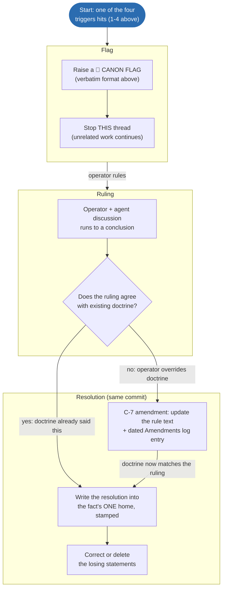

# SlopCanon — the SlopDrive-32 governance doctrine

SlopCanon is the rule system every agent, every commit, and every document in this
repo answers to. It exists because the project's knowledge rotted once already:
status was appended as prose across many files, facts had many homes, claims were
never stamped with how they were verified, and agents resolved contradictions
silently by picking whichever source they read first. A fleet-audit in July 2026
had to be run to un-rot it. These rules make that a one-time event.

The model is the thing that already works here: the SlopSync registry. One source
of truth, everything else derived, a check mode, and a ritual that fixes the doc
*before* the code. SlopCanon applies that shape to the entire project.

The operator understands this system at the architectural level and is not
CS-trained. That is a design input, not a caveat: rules that rely on the operator
catching subtle drift in review do not work. The rules below are built so drift is
caught mechanically or flagged explicitly — never absorbed silently.

---

## 1. The Map of Truth — one fact, one home

Every fact lives in exactly ONE home. Everywhere else refers to it (by name or
link) and never restates it in full. If you find the same fact stated in two
places with different values, that is not information — that is a **flag** (§3).

| Domain | Sole home |
|---|---|
| Wire numbers (frames, CBOR keys, NACK codes, channels, limits) | the SlopSync repo's `spec/registry/registry.yaml` (sibling checkout, pinned by `slopsync.pin` at this repo's root) |
| SlopSync protocol behavior | the SlopSync repo's `spec/SPEC.md` |
| This machine's device-channel allocation | [`docs/slopsync/CHANNEL-MAP.md`](../slopsync/CHANNEL-MAP.md) (stays here — machine-specific, not protocol spec) |
| Governance law — this rule system | this file |
| Engineering doctrine (architecture, motion, subsystem rules, build/deploy procedure) | [`docs/canon/DOCTRINE.md`](DOCTRINE.md) |
| Volatile project/device state (fw versions, what's deployed, what's live-verified, milestone status) | [`docs/canon/LEDGER.md`](LEDGER.md) |
| Operator preferences & working relationship | `CLAUDE.md` (repo root, gitignored) |
| Firmware version constant | `FIRMWARE_VERSION` in `include/system/config_api.h` |
| Subsystem deep detail | that subsystem's own README / spec |
| Public docs site content | SlopSync repo's docs-site — generated/derived from its spec homes, never hand-forked |

`CLAUDE.md` is the auto-loaded entry point: operator preferences plus binding
pointers into this directory. It holds **no rules and no status** — rules live
in CANON/DOCTRINE; status lives in the LEDGER.

## 2. The Laws

**C-1 — ONE HOME PER FACT.** See the map. Adding a fact means deciding its home
first. Restating a fact elsewhere requires a pointer, not a copy.

**C-2 — STATUS IS NOT PROSE.** Anything that changes over time (versions,
"live/deployed/landed" claims, milestone state, known bugs, deferred work) lives
in `LEDGER.md` as discrete stamped entries — never appended as narrative
paragraphs into doctrine or architecture docs.

**C-3 — SAME-COMMIT TRUTH.** A commit that changes behavior, removes a feature,
or completes planned work MUST update the affected fact's home in that same
commit. Doc drift is a defect of the same severity as a failing test.

**C-4 — STAMP OR IT'S HEARSAY.** Ledger claims carry a verification stamp:
`[verified YYYY-MM-DD — method]` (e.g. `— /api/capabilities`, `— pio test -e
native exit 0`, `— live probe 8/8`). An unstamped claim, or one whose subject has
been touched by commits since its stamp, is hearsay: re-verify before building on
it, or flag.

**C-5 — THE FLAG DUTY.** Contradictions between sources, between a doc and the
code, or between a request and doctrine are NEVER resolved silently. Raise a
Canon Flag (§3) and stop that thread until the operator rules. This is the core
rule; everything else exists to make flags rare.

**C-6 — FROZEN MEANS FROZEN.** The frozen list (conformance artifacts, golden
vectors, frozen public APIs — enumerated in [`DOCTRINE.md`](DOCTRINE.md) §9,
hash-pinned mechanically in `tools/canon_lint.py`) is touched only after
a flag and an explicit operator "yes, break compatibility". No exceptions for
"it's just a comment".

**C-7 — DOCTRINE CHANGES ARE MINI-RFCS.** Changing a rule in this file requires:
proposed text + rationale presented to the operator, explicit approval, and a
dated entry in the Amendments log (§6). Agents never edit CANON.md unilaterally.
(The generalized spec-gap ritual: when work needs a rule that no doc defines,
write it into the correct home FIRST — via this process if the home is CANON —
then code against it.)

**C-8 — "WORKING" REQUIRES EVIDENCE.** No claim of live/working/deployed/fixed —
in a doc, ledger, commit message, or chat — without naming the evidence: the
command run and the observed result. "Deployed" specifically means
version-verified on-device per [`DOCTRINE.md`](DOCTRINE.md) §6, not "upload
completed".

**C-9 — DELETE LOUDLY, DEPRECATE VISIBLY.** Removing code requires proof of no
remaining references (state the searches run — src/, include/, lib/, test/,
webui/, sim/, examples/, tools/, platformio.ini, docs) recorded in the commit
message. A doc describing a removed/replaced system gets a dated deprecation
banner at the top on the same commit that removes the system — never left to
read as current.

**C-10 — PERIODIC SCRUB.** The truth-scrub audit (multi-agent contradiction
hunt, `.claude/workflows/`) runs at every milestone merge and whenever the
operator smells drift. Confirmed findings feed fixes AND, where they reveal a
missing rule, a C-7 amendment proposal.

**C-11 — AMERICAN ENGLISH ONLY.** All prose, comments, identifiers, and UI
strings use American spellings (behavior, color, center, license, gray,
initialize, …). Exceptions: vendored third-party code verbatim, legal license
texts verbatim, and frozen wire artifacts — a British spelling baked into a
frozen byte sequence or released wire string is flagged (§3), never silently
respelled, because respelling it is a protocol break. Enforced by canon_lint.

**C-12 — COMMENTS ARE CONSTRAINTS, NOT STORIES.** A code comment states what
the code cannot show: an invariant, a trap, a unit, a contract — in as few
lines as it takes. A terse "do not use for X" on a variable is exactly right.
Marking a section for a planned change is fine ("planned: X — see <doc>").
Comments NEVER reference removed code or libraries — what's gone is gone; only
now matters, and the past lives in git history and dated docs. History,
rationale, and narration live in the organized home for that subsystem; a
comment may carry a pointer there. An agent that wants to explain its story
writes it into the docs and links it — never into a file banner. Existing
rambling banners are debt: shrink on touch.

## 3. The Canon Flag protocol

An agent MUST flag — and stop that thread of work — when any of these hits:

1. Two authoritative sources contradict (doc↔doc, doc↔code, comment↔code,
   ledger↔device).
2. Work would touch anything on the frozen list, or modify/delete code on a
   motion or safety path whose liveness the agent cannot prove statically.
3. The operator's request conflicts with a Law, with a
   [`DOCTRINE.md`](DOCTRINE.md) NON-NEGOTIABLE, or with how the rest of the
   codebase works.
4. A fact the work depends on is unstamped or stale (C-4) and cannot be
   re-verified without hardware the agent shouldn't drive unasked.

Flag format (in chat, verbatim structure):

```
🚩 CANON FLAG — <one line: what conflicts>
Source A: <file:line> "<quote>"
Source B: <file:line> "<quote>"   (or: <the request> / <observed device state>)
My read: <which I believe is correct and why — or "cannot determine statically">
Your call: <the single specific question the operator must answer>
```

Rules of engagement: unrelated work may continue; the flagged thread may not.
Never "fix" one side to match the other before the ruling. After the ruling, the
resolution is written into the fact's ONE home, stamped, and the losing
statements are corrected or deleted — in the same commit.

**Operator override:** when the operator explicitly asks for something doctrine
forbids, the agent flags it (trigger 3), explains the conflict and its
consequences plainly, and the discussion runs to a conclusion. If the operator's
ruling stands against current doctrine, that is not an exception to be quietly
carved out — it is a C-7 amendment: the rule is updated to say what the operator
actually wants, dated in the Amendments log. Doctrine follows the operator;
it is never silently violated AND never silently diverges from operator intent.

**The flag-to-amendment flow, illustrated** (non-normative diagram; the
rule text above governs):



Reading the diagram: the right-hand branch out of the decision diamond is
the operator-override path from the paragraph above — it always lands back
on `write`, because an override is never a silent exception; the rule text
itself changes to match.

## 4. The Ledger

`docs/canon/LEDGER.md` holds all volatile truth as stamped entries, grouped by
domain (device, milestones, known-residuals, deferred). Entry shape:

```
- <fact, one line> [verified YYYY-MM-DD — method]
```

Superseded entries are edited in place or deleted — the git history is the
archive; the ledger is only ever CURRENT truth. Agents read the ledger at the
start of substantive work and update it in the same commit as the change (C-3).
Claude's private memory files mirror the ledger, never contradict it; on
conflict, the ledger wins and the memory gets fixed.

## 5. The mechanical floor — canon_lint

`tools/canon_lint.py` greps the codebase for known doctrine violations (the
classes that have actually bitten this project) and exits nonzero on a hit.
Agents run it before declaring any substantive change done; it is judgment-free
by design — everything it catches is a hard rule, so a hit is a defect, not a
conversation. The check list grows via C-7 when new violation classes are
confirmed (typically by a C-10 scrub).

## 6. Amendments

| Date | Change | Approved by |
|---|---|---|
| 2026-07-27 | SlopCanon established (C-1..C-10, flag protocol, ledger, lint). | operator |
| 2026-07-27 | C-11: American English only, British spellings purged (frozen wire bytes flag-only). | operator |
| 2026-07-27 | C-12: comments are constraints + pointers; narrative lives in docs. | operator |
| 2026-07-27 | Operator-override path added to §3: overrides become amendments, never silent exceptions. | operator |
| 2026-07-27 | C-11 ruling: pre-release wire strings ARE respelled (one atomic catalog-evolution pass, fixtures/goldens regenerated). "Frozen wire artifacts" carve-out applies only to released/frozen bytes. | operator |
| 2026-07-27 | Dead-code ruling: all proven-dead code is deleted (tests before + after). CLAUDE.md restructured: preferences only, all rules/doctrine live under docs/canon/. | operator |
| 2026-07-28 | Map of Truth repointed for the SlopSync repo split: wire numbers + protocol behavior rows now name the sibling checkout (pinned by `slopsync.pin`); CHANNEL-MAP.md row added for this machine's channel allocation. (Recorded retroactively 2026-07-29 by the C-10 scrub — the split commit missed this log.) | operator |
