# Retiring the `:81` UI plane and the HTTP control surface

*Operator rulings + the evidence behind them, 2026-07-26. This is the plan for
the next block of work, and the measurements that made it a priority rather than
a tidy-up.*

> Channel ids herein are historical (pre-C4 renumber); current map:
> [CHANNEL-MAP.md](slopsync/CHANNEL-MAP.md).

**Truth check (2026-07-28): the ruling in §1 is still today's live doctrine —
HTTP is read-only, SlopSync is the only control plane, and that has not
changed.** Everything this document planned has since LANDED: `:81`,
links2004, and all 27 legacy HTTP control routes are deleted (§5.7), the
mode settings moved to SlopSync (§5.6), and authorization is enforced
(§5.5). The refactor call this document ends on (§7, "THE WEBUI NEEDS A
FULL REFACTOR") was answered — the rebuilt, catalog-driven client is
[webui-architecture.md](webui-architecture.md); read that for current
architecture. This document stays as the ruling's record and the
evidence that made it non-negotiable, not as a live status page (status
lives in [`docs/canon/LEDGER.md`](canon/LEDGER.md), per
[CANON C-2](canon/CANON.md)).

---

## 1. The ruling

# NO CONTROLS LIVE OUTSIDE SLOPSYNC. HTTP IS READ ONLY.

Operator, 2026-07-26, emphatically. This is not a direction of travel or a
nice-to-have — it is the constraint every remaining task on this page serves.

If an endpoint can CHANGE the machine, it is a defect until it is a SlopSync
INTENT. That includes `POST /api/slopmotion`, `POST /api/servo`,
`POST /api/settings`, `/api/clearfault`, and every other writer still standing.
"Leave it on HTTP until the SlopSync equivalent lands" is acceptable ONLY as a
temporary state with the replacement actively being built — never as a resting
place, and never as a reason to expose something on HTTP that SlopSync lacks.

The two permanent exceptions are sidebands, not control of the machine:
- **OTA** (`/api/ota`, `/api/ota/fs`) — flashing, deliberately outside the
  protocol.
- **`/uitoken`** — the credential bootstrap; it grants access, it does not move
  anything.

Read-only JSON views (`/api/log`, `/api/capabilities`, `/api/status`,
`GET /api/slopmotion`) stay, for the reason below — but a GET that stays is not
license for the matching POST to.

**Corollary, and it is the whole point of §5.8: a read-only HTTP view is not a
substitute for a SlopSync channel.** If our UI can SEE something over HTTP that
a SlopSync client cannot see over the protocol, that is the same privilege
asymmetry as a control — fix it by adding the channel, never by keeping the
endpoint.

---

*Original phrasing, kept because the reasoning below it is still the argument:*
**No CONTROL over HTTP. Read-only diagnostics MAY stay.**

Permanent, by earlier ruling:
- **OTA** (`/api/ota`, `/api/ota/fs`) — a convenience for devices that ship a
  WebUI, deliberately a sideband and not part of the protocol.
- **`/uitoken`** — same reason.

Allowed to remain, and this is the clarification made on 2026-07-26:
- **read-only JSON views** — `/api/log`, `/api/capabilities`, `/api/slopmotion`.

Everything else on HTTP is control and goes to SlopSync.

### Why read-only survives

The end-state reference already does this. `sim/slopsim` states the doctrine as
*"100% of control goes through SlopSync. HTTP exists only to serve the page and
two read-only JSON views."* So the rule was never "no HTTP", it was "no control
over HTTP", and the diagnostics were always the intended exception.

The practical argument is stronger than the aesthetic one: `slopscope`,
`slopsoak`, `slopsync_probe.py` and every ad-hoc debugging session read those
endpoints. Removing them would mean a device whose SlopSync plane is broken
becomes a device you cannot ask what is wrong. Diagnostics that depend on the
subsystem under test are not diagnostics.

## 2. Why this is the FIX, not cleanup

`:81` (UiSocket, links2004) was assumed to be dead weight awaiting the WebUI
rewrite. It is not — it was the cause of the dropouts the operator reported.

**Matched A/B, same full soak suite, same firmware (2.1.57), motor connected and
homed, clean boot each, ONE variable: whether anything talks to `:81`.**

| | with `:81` | without `:81` |
|---|---|---|
| verdict | **FAIL** | **PASS (7/7)** |
| device reboots | **3** | **0** |
| heap min-watermark | **112 B** | **1,528 B** |
| HTTP failures | 3 | **0** |
| HTTP max latency | **1,247 ms** | **213 ms** |
| HTTP p95 | 103.9 ms | 77.9 ms |
| churn / wedge-chatty | FAIL (rebooted mid-scenario) | PASS |

Raw data: `slopsoak-async-paced-homed-*.json` (arm A),
`slopsoak-armB-full-no-ui81-*.json` (arm B).

Note what this reframes: arm A's `wedge-chatty` failures — "healthy watchers
disconnected", "telemetry never resumed" — were **not** the wedge bug returning.
They were the device rebooting underneath the test. The harness said so itself
("device-side counters reset, so every delta below is untrustworthy") and it was
still nearly misread. A failure that co-occurs with a reboot is a reboot symptom
until proven otherwise.

### The mechanism

`:81` pushes **~94 Hz unconditionally to every connected client** — roughly 5x
SlopSync's 20 Hz — with **no rate negotiation at all**. It is not that 94 Hz is
the wrong number; it is that there is no mechanism by which it could be a
different number for a client that wants less. SlopSync solved this in §10.2
(GRANT does `min(client wish, catalog cap)` per channel); the WebUI has not
adopted it.

**Residual, second-order, NOT urgent:** without `:81` the watermark is 1,528 B —
13.6x better, zero reboots, but not comfortable margin. AsyncWebSocket allocates
per queued message, so multi-client telemetry still churns small allocations.
Worth revisiting AFTER `:81` is gone, when it can be measured without the
dominant term in the way.

## 3. Current state (what has to change)

The WebUI is **dual-plane today**, not SlopSync-only:

- `webui/src/main.js:1015` — `initLink(); // connects ws://<hostname>:81/ws/ui`
- `webui/src/main.js:1016` — `// ---- SlopSync dual-plane bridge (ws://<hostname>:82)`

The firmware still instantiates `UiSocket uiSocket(g_state)` (`src/main.cpp:146`)
with its own sender task, and registers **27 HTTP routes**, including full
control: `/api/move`, `/api/settings` POST, `/api/home`, `/api/stop`,
`/api/pause`, `/api/override`, `/api/servo`, `/api/pattern`, `/api/mode`.

A partial SlopSync client already exists at `webui/src/core/slopsync/`
(`bridge.js`, `catalog.js`, `cbor.js`, `frames.js`, `session.js`, `sha256.js`).
**Extend it — do not rewrite it.** Read it first.

## 4. Order of work (this order is forced)

`:81` cannot be removed first. The live UI depends on it, so removing it before
the SlopSync path works leaves no UI at all. **All five steps LANDED
2026-07-27, fw 2.1.65 — see §5.7 below.**

```mermaid
flowchart LR
    start(["Start: :81 still live,\nSlopSync path incomplete"]):::startNode
    n1["1. SlopSync path reaches parity\nINTENT + ECHO, catalog-rendered settings"]
    n2["2. Verify parity live\npayload sent AND device state change observed"]
    n3["3. Cut the :81 link\nkeep UiSocket compiled one release, rollback-only"]
    n4["4. Retire HTTP control endpoints\nkeep OTA, /uitoken, read-only views (§1)"]
    n5["5. links2004 falls out of the build\nno longer referenced, not a separate step"]
    done([":81 + links2004 gone,\nSlopSync-only"]):::doneNode

    start --> n1 -->|"parity claimed"| n2
    n2 -->|"parity PROVEN, not assumed"| n3
    n3 -->|"UI now SlopSync-only"| n4
    n4 -->|"nothing left references it"| n5
    n5 --> done

    n2 -.->|"soak re-run"| watch["watch: heap min-watermark\n(slopsoak, SlopSync repo)"]
    n5 -.->|"soak re-run"| watch

    classDef startNode fill:#2b6cb0,color:#fff,stroke:#2b6cb0,stroke-width:2px
    classDef doneNode fill:#276749,color:#fff,stroke:#276749,stroke-width:2px
```

Re-run `tools/slopsoak.py` (SlopSync repo) after step 3 and again after step 5 (dashed
lines above). The number to watch is the heap min-watermark; the target is
that it stops being interesting.

> DEMO-CANDIDATE: replay the `wedge-chatty` scenario from
> [ws-transport-baseline.md](ws-transport-baseline.md) side by side,
> links2004 vs. the current async transport, so the "kills every other
> session, permanently" failure and its fix are seen, not just tabulated.

## 5. Telemetry design agreed alongside this

The rate question and the `:81` removal are the same question — a low-rate UI is
only pleasant if you change WHAT is on the wire, not just how often.

- **Plan events** (~2-4/s in Segments mode): the trajectory polynomial, so the
  client evaluates the exact curve the machine is running, at its own refresh
  rate. No 45/60 Hz beat, no aliasing. Caveat: Ruckig guard plans are multi-phase
  profiles, not polynomials — either encode the phases or fall back to sampled
  while one is active.
- **Absolute anchors at 5 Hz, plus one free with every plan commit.** Operator's
  design, and it is the keyframe pattern: periodic absolutes bound error
  accumulation *by construction* rather than hoping deltas stay honest. 5 Hz over
  2 Hz costs ~12 B/s and halves the worst-case desync window to 200 ms, below
  what a human catches during fast motion. The periodic timer is a FLOOR: in
  Segments mode the per-plan anchors already land ~8x/s, so the timer only
  carries an idle machine.
- **Corrections are ABSOLUTE RESIDUALS (`actual - predicted`), not deltas.**
  Residuals are idempotent: lose one and the next fully corrects. Deltas
  accumulate, so a single loss desyncs permanently. Delta/varint coding is for
  the scope stream over a reliable+ordered transport ONLY — `TransportProperties`
  already carries `reliable`/`ordered`, so the protocol can make that choice for
  an implementer instead of leaving it as a footgun.
- **Encoder divergence is an EVENT, never a stream.** `EncoderValidator` exists
  and is report-only. FAS position is the step accumulator — the machine's belief,
  and the working truth (the speedometer reads driveshaft rotation and calls it
  road speed; that holds until the wheels slip, and slip is a *different fault*).
  Streaming the servo encoder to confirm agreement spends continuous bytes proving
  something true ~100% of the time. Publish the *disagreement*.
- **Per-client rate negotiation** (§10.2 GRANT) instead of one firehose: WebUI
  10-20 Hz, slopscope 200 Hz, a phone 2 Hz. Nobody subsidises the greediest client.

## 5.5. AUTHORIZATION IS NOW ENFORCED — and the legacy planes bypass it

**fw 2.1.59 flipped `SlopDriveHubDelegate::validateToken` from "return control
unconditionally" to `/uitoken` → trust ledger → `watch`.** Live-verified 6/6
(`webui/test/slopsync-auth.mjs --expect-enforced`): tokenless → `watch`, valid
mint → `control`, replayed mint → `watch` (single-use now provable from the
wire, not just asserted in a comment).

A demoted client is not a locked-out client. It may connect, fetch the catalog,
subscribe to telemetry, and **still e-stop** — `stop`/`estop` are role-exempt in
0x0005's `option_access` (SlopSync RFC-025b), because safety outranks authorization. What
it loses is the ability to command motion. That is the correct degraded state for
a machine someone may be standing next to.

### The hole, stated plainly

**`:81` requires no credential and neither do the 27 HTTP control endpoints.**
Verified by inspection: there is no token check anywhere in `WebUI.cpp`'s routes
or in `WebSocketTransport.cpp`. So today, anything on the LAN that wants to move
this machine simply does not use SlopSync — it POSTs `/api/move` or opens `:81`,
and the enforcement above never runs.

This means the retirement is no longer only a stability fix. **Until `:81` and
the HTTP control surface are gone, SlopSync authorization is advisory.** The
security argument and the stability argument now point at the same work, which
is a good reason not to let it drift.

### Honest scope of `/uitoken` even after that

While `/uitoken` is enabled (the default), anything on the LAN that can HTTP GET
can mint a control-tier credential — the endpoint's only defense is the absence
of CORS headers, which stops a hostile *web page* and nothing else. So the flip
buys a **real chokepoint, an audit line per authorization, and a default-deny
posture** — not LAN secrecy. The lockdown posture is `/uitoken` DISABLED plus
paired tokens, and `validateToken` already implements it: rung 1 simply stops
answering and rung 2 carries everyone who paired.

### What is NOT yet reachable

**No knock-and-approve ceremony is wired to anything an operator can press.**
`openPairing()` has zero callers, so the trust ledger can never be populated
that way on the real device. Every client is therefore on `/uitoken`, which is
single-use, 60 s, and rate-limited to one mint per 250 ms **device-wide**. That
is correct for a browser (one mint per page load) and wrong for a high-churn
tool, which is why `slopsoak` now mints only for clients that actually publish
a stream.

**Truth check (2026-07-28): `openPresenceWindow()` is no longer one of the
zero-caller functions above.** The firmware's own boot gesture
(three quick power-cycles) now calls it directly — see §7 "Push-to-pair IS
reachable now" below. `openPairing()` (the knock-and-approve ceremony) is
still uncalled; that gap is real and unchanged.

Closing this is the next auth milestone: PAIR_REQ/PAIR_GRANT in `slopsync-js`
plus an operator-reachable PIN window. Until then the lockdown posture is
*implemented but not reachable*.

### Client credential status (all updated in the same batch)

| client | credential | notes |
|---|---|---|
| WebUI | `/uitoken` per connect | `credentials.js` ladder; persistent `instance_id` |
| `slopsync_probe.py` | `/uitoken` w/ 429 backoff | 38/0 green post-flip |
| `slopsoak.py` | `/uitoken`, publishers only | watchers stay at `watch` by design |
| MFP plugin | `/uitoken`, PIN field accepts a 32-hex paired token | was sending UTF-8 PIN bytes, which could never validate |

## 5.6. M5b — the mode settings move to SlopSync (fw 2.1.64)

New settings category: **`0x008A machine-modes` (STATE) + `0x0104 modes-set`
(INTENT)** carrying `blend_mode`, `stream_speed_mode`, `overshoot_clamp`. Fully
SlopSync RFC-009 annotated, so a generic client renders them without knowing this device
exists. Live round-trip verified (`webui/test/slopsync-modes.mjs`): read device
truth → write → ECHO carries the applied value → on-change STATE reflects it →
restore.

**Why a new channel and not more fields on 0x0081:** that channel's RFC-009
`enabled_mask` is a `bitfield8` with seven of eight bits already used. A fifth
limit fits; four mode settings do not, and widening the mask changes an existing
field's type — a protocol break, not append-only evolution. RFC-009's own answer
is a category split, so that is what this is.

**`transport` was retired, not moved.** It briefly existed as a fourth setting
before the operator's call (2026-07-26): SlopSync is the only way in now, the hub
listens on WebSocket and BLE by default, and OSSM-BLE is gone. Key 2 on 0x0104 is
a permanent documented gap. The C5 dongle may return, but as a transport the hub
*has*, not a mode an operator picks.

### Two bugs this found, both of the "renders but lies" class

- **Wrong JSON key.** The intent sent `in["bm"]`; `applySettings` reads
  `doc["blend_mode"] | current`. A wrong key is therefore **silent** — the
  fallback re-applies the existing value and the call succeeds. Caught only
  because the test asserts `echo == request` rather than "the call didn't error".
- **Two sources of truth for one field.** The publisher read
  `_arbiter.getBlendMode()` while the write path stores `_motor`'s. They
  genuinely disagreed live (arbiter 2, motor 1), so the channel was reporting a
  value no write had produced. Both now read the handler's own echo / `_motor`.

### And one that cost a flash cycle

`encodeCatalog()` returns 0 for **two** unrelated reasons: buffer too small, and
entries not strictly ascending by channel id (its very first loop). The device
log said `CATALOG DID NOT ENCODE (scratch N B)` — which reads as a sizing
problem — for what was actually an ordering mistake, and growing the buffer did
nothing. Fixed three ways: the boot check now names the out-of-order pair,
`tools/catalog_lint.py` catches both rules in milliseconds with no build, and the
measured headroom (11659 B of 16384) is recorded in `hub.hpp` so nobody has to
guess again.

### What still makes the HTTP plane load-bearing (as of M5b, fw 2.1.64)

**Truth check (2026-07-28): all four ❌ rows below closed** —
`machine-admin` (0x30F0) is the admin INTENT channel this section asks
for in its last line, and it shipped. Nothing is HTTP-only anymore; see
§1's ruling and the LEDGER's `RESOLVED` entry.

| surface | status |
|---|---|
| window / speeds / accel / jerk | ✅ `0x0081` + `0x0101` |
| blend / stream-speed / overshoot | ✅ `0x008A` + `0x0104` (M5b) |
| move / home / pattern / safety / override / bypass | ✅ existing intents |
| motion + safety + odometer + power + diag telemetry | ✅ existing STATE |
| transport selector | ✅ retired, not needed |
| **servo configure pane** (`/api/servo`) | ❌ HTTP only → ✅ `machine-admin` 0x30F0 |
| **SlopMotion tuning** (`/api/slopmotion`) | ❌ HTTP only → ✅ §5.9 |
| **clear fault** (`WS_OP_CLEAR_FAULT`) | ❌ HTTP only → ✅ `machine-admin` 0x30F0 |
| **save to NVS** (`WS_OP_SAVE`) | ❌ HTTP only → ✅ `machine-admin` 0x30F0 |
| `/api/log`, `/api/capabilities`, `/api/status`, presets | ✅ read-only, staying per §1 |

Four control surfaces left, at the time this was written. The last two are
actions rather than settings, so they want an admin INTENT channel, not
another settings pair — which is exactly what `machine-admin` became.

## 5.7. M5c — links2004 is GONE (fw 2.1.65)

**SlopSync is the only input and output.** Operator ruling, 2026-07-26.

Deleted outright:
- `src/ui/UiSocket.{h,cpp}` — the `:81` telemetry plane, plus its sender task,
  its `/api/clients` enumerate/kick endpoint, and the `OtaService` coupling that
  suspended it during a flash.
- `src/comms/WebSocketTransport.{h,cpp}` — the `:55555` Intiface/TCode
  WebSocket, both the inbound server and the outbound WSDM client. Intiface is
  planned to gain native SlopSync support, so the device speaking *Intiface's*
  protocol is the wrong direction of travel.
- `include/comms/SlopSyncWsTransport.h` + `.cpp` — the blocking-send SlopSync
  transport the A/B replaced.
- `webui/src/core/link.js` — the browser half of `:81`.
- `links2004/websockets` from `platformio.ini`. PlatformIO's own line on the
  next build: `Library Manager: Removing WebSockets @ 2.7.3`.

`-DSLOPSYNC_WS_ASYNC=1` and the vendored async pair moved from `env:sd32-async`
into `env:sd32`, because with one transport left it is no longer optional —
`SlopSyncHubService` names `SlopSyncAsyncWsPort` unconditionally. `sd32-async`
now differs from `sd32` in nothing and is kept only so existing commands and
docs keep working.

### What had to move first

`:81` carried two jobs nothing else did, and both are now SlopSync-native:
- **0x0086 plan-strip → `interpState`** (the debug overlay / planned-path
  renderer). Units already matched exactly — the legacy decoder read
  `getUint16()/10000` and the channel declares scale 10000 — so nothing is
  rescaled. Style names resolve from the CATALOG's option labels, never a client
  table: the firmware grew a fourth plan kind (`cubic`) after that UI was
  written, and a hardcoded table would have mislabeled it.
- **0x0089 motion-anomaly EVENT → the anomaly log**. An EVENT, not a STATE —
  one frame per occurrence, which is why it must never be polled or conflated.

Plus the plumbing: `getLinkStats()` on the bridge reproduces link.js's stats
shape so `conn.js`'s header dot and `diag.js`'s gap shading needed no changes,
and `shadow.js`'s `isFallback()` is now `!isSlopSyncLive()` — same condition,
different source.

**HTTP fallback stays.** When SlopSync is down the page still polls
`/api/status` and `cmd.js` still routes ops to their `/api/*` twins. A machine
whose hub plane is broken must remain observable and controllable; the §1
argument about diagnostics that depend on the subsystem under test applies just
as well to the last-resort control path.

### Measured

| | with `:81` | without `:81` | links2004 GONE |
|---|---|---|---|
| static RAM | — | 105,884 B | **98,268 B** |
| flash | — | 2,081,288 B | **1,867,388 B** |
| boot heap free | — | 103,052 B | **123,720 B** |
| post-slopsync free | — | 66,024 B | **86,624 B** |
| post-slopsync maxblock | — | 31,732 B | **45,044 B** |
| soak heap min-watermark | 112 B | 1,528 B | **1,164 B** |
| soak-scenario heap floor | 35,528 B | 31,556 B | **52,724 B** |
| device reboots, full suite | 3 | 0 | **3** |

**CORRECTION — READ THIS BEFORE TRUSTING §2.** The 25,536 B watermark first
recorded here was measured on a SINGLE-SCENARIO run (`--scenario b2b`, 45
seconds) and does not survive the full suite, which reports **1,164 B**. Quoting
a short run's watermark as if it were the suite's was the same class of error as
the "62× more margin" claim in §2: a number measured under light load, reported
as though it characterised load.

**AND THE REBOOTS ARE NOT FIXED.** fw 2.1.65, with links2004 deleted outright,
rebooted three times in the full suite (twice in `churn`, once in
`wedge-chatty`) — the same count and the same two scenarios as arm A. So §2's
conclusion, *"`:81`/links2004 is the cause of the reboots"*, is WRONG, or at
best is one contributing term among others. One run per arm was never strong
enough evidence for a causal claim, and the arm-B zero was taken at face value
because it agreed with the hypothesis.

What the removal DID buy, and this part is solid because it is structural rather
than statistical: ~7.6 KB of static RAM, ~214 KB of flash, +20 KB free heap at
boot, +13 KB of largest contiguous block, and a soak-scenario heap floor that
rose from 31.5 KB to 52.7 KB. Ports 81 and 55555 now refuse connections; 82
answers. Those are worth having on their own terms. They are not a reboot fix.

**RESOLVED — field bug #5, fw 2.1.68.** The backtrace found it in minutes, as
it did for #4, and it was MINE: the ESP32Async transport written this session.

`SlopSyncAsyncWsPort::onEvent` runs on the **AsyncTCP task** and called
`_hub->detachTransport()` on disconnect, nulling `slot.transport`. The **hub
task** was meanwhile inside `Hub::update()`, which null-checks that pointer once
at the top of its slot walk and dereferences it several calls deeper in
`pumpStatePacing()` -> `sendFrameTo(*slot.transport, ...)`. Cross-task TOCTOU:
`LoadProhibited`, Core 0, `EXCVADDR 0x00000000`, A2 (first argument) = 0.

links2004 could not have had this: its `loop()` was pumped BY the hub task, so
its callbacks already ran there. Going async moved them to another task and the
one-task invariant left with them — silently, while the header still documented
it. So `:81` was not the reboot cause; the transport that REPLACED it was, and
the A/B's arm-B zero was luck.

Fix: `onEvent` records intent in atomics, `loop()` (hub task) performs the
attach/detach, detach processed first. Plus library hardening — `update()` now
re-checks `slot.transport != nullptr` alongside `occupied()`, so the hub cannot
be crashed by a transport that gets this wrong.

**And the regression that fix caused, which is worth as much as the fix:**
`open()` reset the RX ring, justified by the comment *"safe because open() runs
on the hub task with no client attached yet, so there is no concurrent
producer"*. Deferring attach made that false — HELLO now lands in the ring
BEFORE `open()`, which discarded it, and every session died at its handshake
timeout (**0/30** churn cycles). `attachClient()` already reset the ring at the
correct boundary. *A comment that justifies an action by asserting an ordering
is the first thing to re-read after you change that ordering.*

**VERIFIED, full suite, fw 2.1.68** (`slopsoak-fieldbug5-fixed-*.json`):

| | arm A (`:81`) | arm B | 2.1.65 (no links2004) | **2.1.68 (#5 fixed)** |
|---|---|---|---|---|
| device reboots | 3 | 0 | 3 | **0** |
| churn | FAIL | PASS | FAIL | **PASS 30/30** |
| wedge-chatty | FAIL | PASS | FAIL | **PASS** |
| HTTP failures | 3 | 0 | 2 | **1 / 348** |
| HTTP max latency | 1,247 ms | 213 ms | 3,574 ms | **503 ms** |
| soak heap floor | 35,528 B | 31,556 B | 52,724 B | **65,020 B** |
| stream loss | — | 7 | 0 | **0 / 5,886** |

Best run on record, and note WHICH change earned it: 2.1.65 already had
links2004 deleted entirely and still rebooted three times. **The reboot fix is
field bug #5, not the library removal.** Recording that explicitly because the
opposite attribution is exactly the error §2 made, and a clean run is the most
tempting moment to repeat it in reverse.

The suite still reports FAIL overall on ONE `/api/status` poll out of 348
(0.3%), with a 503 ms worst case. That is the same open thread as the watermark
below — not a reboot, not a disconnect, not a lost frame.

### The remaining thread: a transient heap borrower, NOT exhaustion

Operator's observation, and it reframes every heap number on this page:
*"heap exhaustion never seems to be the issue... something is using it freely
until it's needed elsewhere or no longer needed."*

The evidence agrees. Sampled free heap sits flat at 70–72 KB for 17 minutes with
no leak (slope −78 B/min against 3.8 KB of noise), while the device's `min`
watermark reads **1,856 B** — and it kept finding NEW lows late in the run
(2,704 → 2,196 → 1,856 at 11–18 min uptime). So something periodically takes a
~68 KB transient bite and gives it straight back.

**`ESP.getMinFreeHeap()` is MONOTONIC SINCE BOOT.** One spike pins it forever.
Every "watermark = our margin" reading on this page — including §2's 112 B — was
therefore wrong in kind: it is the single deepest instant ever, not the
steady-state headroom. It also explains why no failure ever correlated with it:
field bug #5 panicked with 123 KB free.

NOT `/api/log` (measured: 4,911 B response). Next step is a load bisect on a
FRESH BOOT, since the watermark resets there — idle, then HTTP-only, then
WS-only, then both; whichever step first drives it down owns it. Candidates it
would separate: AsyncWebSocket's per-message heap copy under multi-client
telemetry, the catalog BLOB burst (8 chunks/tick x 5 slots), lwIP/TCP buffers on
connection churn. **Do not name a culprit before the bisect.**

Verified after removal: JS suites 4/4 (auth-enforced, modes, write-plane,
live×2), wire golden-byte, probe 38/0, native 31/31, `sd32-ota` builds green.

## 5.8. NO PRIVILEGED CLIENT (operator goal, 2026-07-26)

> *"my goal is that the ui we have and the ui we build with tauri 2 are 99% in
> feature parity... I don't want devs to goose their own ui, making 3rd party
> clients less rich"* — and, on how to get there: *"don't gimp our ui, just make
> it as nice on another machine"*.

**The rule: level the PROTOCOL up, never the UI down.** No feature is removed
from the hosted WebUI. What changes is that nothing it can do stays reachable
only over device-specific HTTP — every capability becomes a SlopSync channel, so
a third-party client is as rich as ours by construction rather than by goodwill.

The Tauri build is then trivially at parity because it is the SAME BUNDLE; the
only intended differences are widget choice and layout.

### The asymmetry ledger — what our UI can do that a SlopSync client cannot

**Truth check (2026-07-28): every row below marked ❌ has since closed.**
`machine-admin` (0x30F0, device-defined INTENT: `clear_fault`/
`save_config`/`servo_scan`) replaced the retired HTTP control routes; see
[`docs/canon/LEDGER.md`](canon/LEDGER.md). The table is kept as the
original asymmetry snapshot that justified the work, not as current
status.

| surface | endpoint | status (as of 2026-07-26) |
|---|---|---|
| SlopMotion live tuning (17 knobs) | `/api/slopmotion` | ❌ HTTP-only → §5.9 (LANDED since) |
| Servo status + register config | `/api/servo` | ❌ HTTP-only (LANDED since — `machine-admin` 0x30F0) |
| clear fault | `/api/clearfault` | ❌ HTTP-only (LANDED since — `machine-admin` 0x30F0) |
| save to NVS | (`WS_OP_SAVE`) | ❌ HTTP-only (LANDED since — `machine-admin` 0x30F0) |
| capabilities (rail, ceilings, features) | `/api/capabilities` | ⚠️ duplicated — SlopSync RFC-016 says capability discovery IS catalog introspection |
| pattern presets | `/api/pattern/presets` | ⚠️ SlopSync RFC-021 store channel exists; not wired |
| limits, modes, move/home/pattern/safety | — | ✅ SlopSync |
| all telemetry incl. plan-strip + anomalies | — | ✅ SlopSync |

`/api/log` and `/api/status` stay as read-only fallbacks per §1 — they are not a
privilege, they are what keeps a machine with a broken hub plane diagnosable.

### 5.9. The constraint the tuning surface hits, and the chosen shape

**LANDED.** The tuning card described below exists and is rendered from
the catalog, not hardcoded — see [webui-architecture.md](webui-architecture.md)
§5, catalog cost accounting.

SlopMotion exposes **17** live-tune knobs. RFC-009's `enabled_mask` is a
`bitfield8` whose bit *i* gates the *i*-th setting-annotated field of its
channel, so **a settings channel cannot carry more than 8 settings** — the same
wall M5b hit at four. `bitfield8` is the only bitfield type in the registry;
widening it would be a registry + spec + codegen change and a wire-format
addition.

Chosen instead — no protocol change, no feature loss:

- **STATE cards share ONE INTENT channel.** `settingChannel` is declared per
  entry and `setting_key` is a key *within that INTENT channel*, so several STATE
  channels may point at the SAME writer as long as their keys do not collide.
  Several cards, one write path.
- **`Catalog32`'s entry capacity rises 32 → 40** (and schema/label pools with
  it). RFC-009 anticipated this exactly — "a RAM knob that must rise for
  settings-dense categories". 28 entries are in use; landing exactly on the old
  cap is not a margin. *(Landed and green.)*

### Which knobs — slopsim is the curated list, not `SystemState`

`SystemState` carries **17** `sm_tune_*` fields. That is not the surface to
expose: it is every knob that has ever existed, including ones superseded by
later work. **slopsim's TUI is the operator's own live-tuning surface**, and it
exposes **13** — the ones actually reached for:

`curve`, `policy`, `margin`, `smoothbudget`, `ampbudget`, `blendsteps`,
`reshapesteps`, `settlegrace`, `jmax`, `aimff`, `centering`, `centeringgain`,
`speedmode`.

`speedmode` is already live on `0x008A machine-modes`, so **12 remain — which
fits in TWO channels, not three**:

- `0x008B slopmotion-waveform` (8): `curve_policy`, `infeas_policy`,
  `infeas_margin`, `smooth_budget`, `amp_budget`, `blend_steps`,
  `reshape_steps`, `settle_grace_us`
- `0x008C slopmotion-chase` (4): `jmax_ovr`, `aim_extrap`, `centering`,
  `centering_gain`
- `0x0105 slopmotion-set` (INTENT, keys 1..12)

Deliberately NOT exposed — present in `SystemState`, absent from slopsim, and
believed obsolete: `vmax_ovr`, `amax_ovr`, `chase_ff`, `chase_gain`,
`chase_look`, `dense_us`, `handoff_k`. The catalog is not the place to memorialize knobs
nobody turns — but note that "leave them on `/api/slopmotion`" is NOT an option
for the WRITE path under §1: `POST /api/slopmotion` is control and is going.
Either a knob earns a catalog key or it stops being settable at all. **Confirm
which, per knob, before deleting.**

### Where device-specific tuning belongs

Operator ruling: *"ultra universal controls go in the hardcoded channel, our
custom tuning stuff you wouldn't see on 90% of machines go in user land"*.

These are all `≥0x0080` — this device's own allocation — which is exactly right.
The registry-owned `0x0001–0x0007` range is for things every conforming hub has;
a quintic reshape budget is not that. No registry change, no spec change, and a
generic client renders these cards from the catalog annotations without SlopSync
ever having to bless a SlopDrive concept.

NOT persisted, by design — the tuning knobs are a session surface
(`/api/slopmotion` already behaves this way; a reboot restores defaults).

## 6. Also ratified 2026-07-26

**TX drop policy = B (`Classify`)** — `SlopSyncTxPolicy::Classify`, already the
default in `SlopSyncAsyncWsTransport`. Shed `STATE`/`STREAM` only (the registry's
own control/data/raw classification decides, not a judgment call); control frames
refuse honestly and tear the session down only after `kCtrlStallMs` of continuous
failure. Survived the full soak suite twice.

**Blob transfer self-expiry: NOT added.** A transfer against a permanently wedged
transport stays armed (92 B, one per slot, cleared at teardown) rather than
self-timing-out. §10.4 eviction and §6.5 idle reaping already end that session;
a second timer would invent a rule the spec does not have to reclaim 92 bytes.

---

## 7. THE WEBUI NEEDS A FULL REFACTOR, NOT MORE WIRING

Operator, 2026-07-27, after the M5c control-plane migration:
*"seems like a lot of the webui mod has just been wiring, it needs a FULL
refactor"* — and that is the correct read of what M5c actually did.

### What M5c really was

Every control was migrated by HAND-MAPPING one legacy op to one SlopSync intent
(`cmd.js`'s `_slopsyncRoute`). It works, and it is the right emergency fix for a
control surface I broke — but it is a translation layer bolted onto a page that
still believes in hardcoded cards. The proof it is wiring and not architecture:
**adding the 20 SlopMotion tuning settings to the protocol produced exactly zero
UI.** The channels are live, annotated, persisted and provably round-tripping,
and the page shows nothing, because nothing in the page is built from the
catalog.

That is the same asymmetry §5.8 is about, pointed inward. A hosted UI that knows
this device's channel numbers by heart is a UI no third party can match — not
because they lack access, but because we never proved the generic path works by
using it ourselves.

### What the refactor IS

**Render the settings surface FROM the catalog. Full stop.** RFC-009 already
specifies the whole algorithm and the device already emits every annotation it
needs:

1. adopt catalog -> collect every field bearing `setting_key`
2. group by `category` (spans channels, §8.8) -> tabs; then by `group` -> cards
3. pick the widget from the TYPE: `u8`+`options` = dropdown, `bitfield8` =
   checkbox group, numeric+`min`/`max`(+`step`) = slider, `str` = textbox
4. adopt the retained STATE as the value; gray from `enabled_mask`
5. write `{setting_key: value}` to the entry's `settingChannel`
6. render the post-clamp ECHO, never the request

A page written that way gains the tuning tab, the modes card and every future
settings channel **for free, with no client change** — which is the actual test
of whether the protocol is any good. Hand-written cards survive only where a
control is genuinely bespoke: the rail, the hero readout, the pattern grid,
the e-stop.

### What stays

`webui/src/core/slopsync/` is sound and stays — session, catalog decode, cbor,
frames, credentials, identity. The refactor is ABOVE that line: `features/*.js`
and `main.js`, which are the parts that hardcode this machine.

`cmd.js`'s routing table is explicitly a BRIDGE. It should shrink to nothing as
controls become catalog-rendered, and its disappearance is the completion
signal.

### Do this BEFORE the Tauri shell

Tauri was scoped as "~5 lines of delta". That only holds if the page is generic;
packaging a hardcoded page just ships the same privilege problem in a window.

### The other half: pairing has no ceremony

Operator, same message: *"no knock and approve when connecting the mfp plugin"*.
Correct — `PairingManager` implements knock/approve, PAIR_REQ/PAIR_GRANT are
wired in the hub, and `openPairing()` STILL HAS ZERO CALLERS, so no client can
ever be approved. Today every client bootstraps on `/uitoken`, which any LAN
peer can mint. Until an operator-reachable approve flow exists, "authentication
is enforced" means LAN trust with an audit line — see §5.5's honesty note.

That flow is UI work too, and it belongs in the refactor rather than bolted on:
a knock arrives -> the page shows who is knocking (kind, name, version from the
trust channels) -> operator approves -> `grant()` issues a durable token. The
plugin already has the PIN box and already presents a token in HELLO; the
missing piece is entirely on the machine's side of the glass.

#### Push-to-pair IS reachable now (M5, firmware boot gesture)

The knock-and-approve gap above (mode (a), `pairing_modes` bit0) is still open
— it needs the WebUI ceremony described above. But mode (c), push-to-pair
(`pairing_modes` bit2), landed on the firmware side without any UI at all,
because SlopSync RFC-027(c) deliberately requires no display and no button: *"the power
cord is the button."*

`SlopSyncHubService::checkQuickBootPairingGesture()` (called once from
`init()`, after `loadPairing()` so the factory-fresh check sees the restored
ledger) keeps an NVS counter (`"qboots"`, namespace `slopsync`) of consecutive
boots that reach init() before the previous boot's 10 s survival mark. At 3 it
calls `Hub::openPresenceWindow()` and raises `SlopGlow::GlowState::Pairing`.
`SlopSyncHubService::pumpPresencePairingWindow()` runs every 1 Hz tick
thereafter: it resets the streak once a boot has genuinely survived past 10 s
(so an unrelated later reboot doesn't inherit a stale count), and mirrors the
window's open/auto-expired state onto SlopGlow (the library never touches an
LED itself).

**Operator gesture:** power-cycle the machine three times in quick succession
(each boot within ~10 s of the previous one starting). On the third, the
Pairing SlopGlow state lights and the boot log shows `pairing: PRESENCE WINDOW
OPEN (3 quick power-cycles) — pair within 120 s`. Any client's PAIR_REQ within
that window is granted with no approval step — `configure` if the ledger holds
no configure token yet (factory-fresh: possession is root), otherwise the
hub's configured default role (`control`). The window is single-grant and
closes on the first knock or after 120 s, whichever comes first.

This does not replace the knock-and-approve UI work above — it covers the
"machine has nobody it trusts yet" case (initial claim, or recovery after a
factory reset) and the "I'm standing at the machine" case. A machine that
already has a configure-holder still needs the approve ceremony for every
LATER client, which is exactly the gap still open.

### The bar: GOLD STANDARD, 100% SlopSync-compliant, best practice

Operator, 2026-07-27: *"this webui needs to both be gold standard and 100%
SlopSync compliant and best practice"*. That raises the goal from "works" to
"is the reference implementation", so write the bar down as testable claims
rather than an adjective:

1. **Zero device knowledge in the rendering layer.** No channel id, no
   `setting_key`, no field name, no option label hardcoded above
   `core/slopsync/`. The test is mechanical: grep the feature layer for `0x00`
   and for known field names; a clean result is the claim.
2. **It renders a machine it has never met.** Point it at `sim/slopsim` with a
   deliberately different catalog and the settings surface must come up correct
   and complete. If it only works against THIS device, it is our UI, not a
   client.
3. **A new firmware settings channel needs no client change.** This is the
   single sharpest test and M5c currently fails it: 20 tuning knobs shipped and
   the page shows nothing.
4. **Ground truth, everywhere, provably.** Every control renders reported state,
   shows pending until ECHO, reverts on NACK/timeout, and grays from
   `enabled_mask`. No optimistic state anywhere —
   [DOCTRINE.md](canon/DOCTRINE.md) §3 calls a UI that
   lies about machine state a safety defect on this product, and it means it.
5. **Degrades honestly.** Watch tier grays the write plane but keeps e-stop live
   (role-exempt by catalog, RFC-025b). Hub down = controls fail visibly, never
   silently. No fallback control path exists any more, and the UI must say so.
6. **Unknown things render generically, never crash.** Unknown role, flag,
   category, annotation key or channel = fallback rendering (SPEC §8.8 item 8).
   A hub newer than the client must degrade, not break.
7. **Accessible + responsive by default.** Keyboard reachable, `prefers-reduced-
   motion` honored (already true of the pending styling), touch targets sized
   for a phone. "Gold standard" is not just architecture.
8. **The bundle is the product.** One build serves device-hosted and Tauri; the
   only permitted delta is credential acquisition and host selection.

Best-practice notes that fall out of the protocol rather than taste:
- **Subscribe at the rate you will DRAW** (§10.2 GRANT). A UI asking 200 Hz to
  render 60 is taxing every other client on the machine.
- **EVENT channels are events**: anomalies and log lines are appended, never
  polled or conflated.
- **Present the cached catalog etag in HELLO.** It is the 99% reconnect path and
  it costs nothing.
- **Never trust `total_bytes` unbounded** — the blob cap exists for a reason,
  and it silently broke the client once already (§5.7 aftermath).
