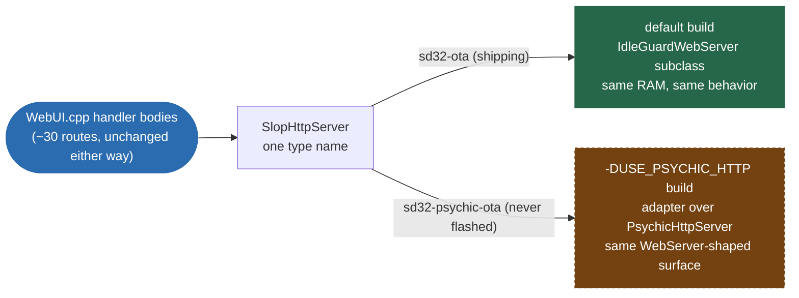

# PsychicHttp migration — the HTTP backend A/B

**Status:** built green on both sides, **never flashed**. Everything below about
runtime behavior is reasoned from the library source, not observed on the
device. The first Psychic boot is the operator's experiment.

This is the re-evaluation [REFACTOR-ROADMAP.md](REFACTOR-ROADMAP.md) §4
calls for, now that HTTP is static-files + OTA only
([http-plane-retirement.md](http-plane-retirement.md)). No live numbers
exist yet for this backend specifically — everything here is design and
build evidence, not a flashed result.

> DEMO-CANDIDATE: capture the browser Network tab's TTFB on `/` and
> `/api/status` side by side, sync `WebServer` vs. PsychicHttp, with a
> Chromium speculative-socket parked — the 5 s quantized stall this
> migration exists to kill, shown rather than described.

---

## 1. Why

The synchronous Arduino core `WebServer` serves **one connection at a time**. In
`HC_WAIT_READ` it waits `HTTP_MAX_DATA_WAIT` (5000 ms, a bare `#define` with no
override guard) for the connected client to send its request bytes — serving
nobody else meanwhile. Chromium routinely opens **speculative pool sockets**
that connect and sit silent, so each one deafens the whole server for 5 s.

Measured live 2026‑07‑24 with a single open UI tab: time‑to‑first‑byte quantized
at 4.8–5.0 s (one capture) and 9.7 s (two back to back). TCP connect instant,
radio clean, `[STALL]` silent — the wait loop yields normally, so no task‑level
watchdog can see it. `include/ui/IdleGuardWebServer.h` is the band‑aid (it drops
connected‑but‑silent clients after 300 ms).

**PsychicHttp** wraps ESP‑IDF's `esp_http_server`, which `select()`‑multiplexes
N sockets on one task. A silent speculative socket simply never becomes
readable, so it costs the server *nothing*. The stall class is structurally
impossible — not mitigated, gone.

> Note the fix is **multiplexing**, not parallelism. `esp_http_server` still
> runs every handler on a single task (that is deliberate here — see §5).

---

## 2. Which env is which

| Env | HTTP backend | Upload | Notes |
|---|---|---|---|
| `s3_main` | sync `WebServer` | serial | unchanged |
| `sd32` | sync `WebServer` | serial | unchanged — rescue path |
| `sd32-ota` | sync `WebServer` | **espota / OTA** | **unchanged — today's shipping path** |
| `sd32-psychic` | **PsychicHttp** | serial | Psychic rescue/bench flash |
| `sd32-psychic-ota` | **PsychicHttp** | **espota / OTA** | the A/B target |

Both OTA envs run `pre:build_webui.py` **and** `pre:tools/ota_auth.py`, so
`SECRET_OTA_PASSWORD` is fed to espota exactly the same way. The secret is not
duplicated, restated, or logged anywhere in this change.

### Build / deploy

```bash
PIO=%USERPROFILE%\.platformio\penv\Scripts\platformio.exe

# A side (today)
$PIO run -e sd32-ota            # build
$PIO run -e sd32-ota -t upload  # firmware over the air
$PIO run -e sd32-ota -t uploadfs

# B side (Psychic)
$PIO run -e sd32-psychic-ota
$PIO run -e sd32-psychic-ota -t upload
$PIO run -e sd32-psychic-ota -t uploadfs
```

The LittleFS web bundle is **identical** between the two — `uploadfs` from
either env produces the same image, so A/B‑ing the firmware does not require
re‑uploading the UI.

### Sizes (measured, this tree)

| Env | RAM (static) | Flash |
|---|---|---|
| `sd32-ota` | 105 124 B (32.1 %) | 2 005 460 B (30.6 %) |
| `sd32-psychic-ota` | 105 148 B (32.1 %) | 2 044 616 B (31.2 %) |

**+24 bytes static RAM, +38 KB flash.** The server object is `new`‑allocated and
the httpd task stack comes from the heap, so almost nothing lands in BSS. The
*heap* cost is real though — see §5.

---

## 3. How to A/B

1. Flash `sd32-psychic-ota` (`-t upload`). ~10–15 s offline, normal.
2. `curl http://192.168.1.229/api/capabilities` — confirm `fw_version`.
3. Open the UI, hard‑refresh, watch the browser devtools **Network** tab.
   The thing to look at is **TTFB on `/` and on the `/api/status` poll**. On the
   sync backend those quantize at 4.8–5.0 s / 9.7 s when a speculative socket is
   parked. On Psychic they should be tens of milliseconds, always.
4. Leave a tab idle for a few minutes, then interact — that is when the sync
   backend's speculative sockets bite hardest.
5. Check `/api/log` for `[STALL] http:ui.update` lines. Under Psychic
   `ui.update()` no longer serves requests at all, so that stall line should
   never appear again for HTTP reasons.

### Falling back

`pio run -e sd32-ota -t upload`. That is the whole rollback — same partition
table, same NVS, same LittleFS image, same OTA endpoint and token. The two
firmwares are interchangeable in both directions.

If the Psychic build's OTA endpoint is what broke, the fallback is
`pio run -e sd32 -t upload` over USB (bench operation, `sd32` env, COM11).

---

## 4. What actually changed

### The seam: `include/ui/SlopHttpServer.h`

One type name, two implementations, chosen by `-DUSE_PSYCHIC_HTTP`:



* **default** — `class SlopHttpServer : public IdleGuardWebServer` — a
  zero‑member subclass with inherited constructors. Same code generation, same
  static RAM, same behavior as before.
* **`-DUSE_PSYCHIC_HTTP`** — a request‑scoped adapter over `PsychicHttpServer`
  presenting the *exact* `WebServer` surface the handlers already use:
  `on() / begin() / handleClient() / collectHeaders() / method() / arg() /
  hasArg() / header() / hasHeader() / sendHeader() / send() / streamFile()`.

**`src/ui/WebUI.cpp` handler bodies were not touched.** All ~30 route handlers
still call `_httpServer->send(...)`, `->arg("plain")`, `->method()` etc. Only
four things in that file changed: the include, the `new SlopHttpServer(...)` in
the constructor, one comment in `init()`, and the `dropIdleCapture()` line in
`update()` (now `#if`‑guarded). This was deliberate — the alternative was two
copies of 2 200 lines that would immediately drift.

### `IdleGuardWebServer` is absent, not unused

Its header `#error`s if included under `-DUSE_PSYCHIC_HTTP`, **and** the Psychic
envs set `lib_ignore = WebServer`. Verified by symbol table:

```
sd32-ota          WebServer:: 53   IdleGuardWebServer 4   PsychicHttpServer:: 0
sd32-psychic-ota  WebServer::  0   IdleGuardWebServer 0   PsychicHttpServer:: 32
```

`lib_ignore = WebServer` is a **hard requirement**, not tidiness: PsychicHttp
3.1.2 and arduino‑esp32 3.3.9's `WebServer` both define
`AuthenticationMiddleware`, `CorsMiddleware` and `LoggingMiddleware` in the
global namespace. Compiling both is a guaranteed multiple‑definition link
failure.

### OTA: factored, not forked

`src/system/OtaService.cpp` now has ONE `Update.begin/write/end/abort` state
machine (`otaBeginWrite / otaWriteChunk / otaEndWrite / otaAbortWrite`) and ONE
final‑response policy (`sendUploadResult`), shared by both backends. Only the
~15 lines that shovel chunks into that pump differ, because the two frameworks
deliver chunks differently. Auth, the constant‑time compare, the safety gate
(`prepareForOta` → stop pattern, e‑stop, park the WS sender, raise
`ota_active`), and the send‑200‑then‑arm‑reboot‑then‑`finishOta(true)` ordering
are literally the same code on both paths.

Two things the Psychic path does *better*:

* **Auth is checked before the body is touched** (headers are available up
  front) instead of on the first chunk. On failure it still drains the whole
  body and answers 401, exactly like today — that is what keeps `curl` reporting
  a clean 401 instead of a broken pipe.
* **The failure path is explicit.** `PsychicUploadHandler::handleRequest()`
  answers 500 and never calls the final callback when a transfer dies, which
  would leave the `Update` session open and `_active` latched until reboot. A
  `handleRequest()` override catches that and runs the salvage path. (Same bug
  shape as the SlopSync ownership‑teardown leak: a resource released on *one*
  path only.)

One hardening rides along on **both** backends: a transfer that never reached
its final chunk can no longer be reported as a flashed image (`_uploadFinished`
guard → 400 `incomplete upload`, `Update.abort()`).

### Other files

`WebUI.h`, `OtaService.h`, `SlopSyncUiToken.{h,cpp}`, `SlopSyncHubService.{h,cpp}`
had `WebServer*` swapped for `SlopHttpServer*`. No logic changes.

`GET /uitoken` **still sets no CORS headers on either backend** — verified by
grepping the whole tree for `Access-Control` / `enableCORS` / `DefaultHeaders`
(zero hits). PsychicHttp applies `DefaultHeaders::Instance()` to every response;
we never populate it, so it stays empty. The absence remains the mechanism.

### A platform bug you will hit again

pioarduino's curated `CPPPATH`
(`packages/framework-arduinoespressif32-libs/esp32s3/pioarduino-build.py`) lists
`esp_https_ota/include` and `esp_https_server/include` but **not**
`esp_http_server/include` — while `-lesp_http_server` *is* in the link line. So
the IDF HTTP server is linkable but its header is unreachable, and any library
that includes `<esp_http_server.h>` fails with "No such file or directory". The
psychic envs add the path back.

It must be added as `-I$PROJECT_PACKAGES_DIR/...` (a SCons variable), **not**
`-I${platformio.packages_dir}/...`. The ini‑level interpolation yields a Windows
path with backslashes and SCons' `ParseFlags` silently eats them —
`C:\Users\Atlan\.platformio\packages/…` arrives in `CPPPATH` as
`C:UsersAtlan.platformiopackages/…` and the header is *still* not found, with no
error explaining why. That cost a debugging cycle; don't repeat it.

---

## 5. The httpd config, and why

Set in `SlopHttpServer`'s constructor (`src/ui/SlopHttpServer.cpp`):

| Field | Value | Why |
|---|---|---|
| `core_id` | **0** | IDF default is `tskNO_AFFINITY`, which would let the httpd task land on **Core 1 — the motion core**. Non‑negotiable ([DOCTRINE.md](canon/DOCTRINE.md) §2). |
| `task_priority` | **1** | Same priority HTTP is served at today (httpTask). Deliberately **below** commsTask (2) and the SlopSyncHub task (2): the hub drains the 0x2100 inbound motion stream every 5 ms and a 115 KB page stream must never preempt it. httpd spends its life blocked in `select()`, so responsiveness does not suffer. |
| `stack_size` | **12288** | Psychic's default is 8192; httpTask (which runs the same work today) is also 8192. Headroom taken on purpose: worst case is LittleFS/VFS file I/O + ArduinoJson + `Update.write()`. Two prior stack‑overflow incidents in this project, and host tests never see them (megabyte stacks). **Comes from the internal heap, not BSS.** |
| `max_open_sockets` | **4** | See the budget below. |
| `lru_purge_enable` | **true** | Chromium opens up to 6 sockets per origin; with purge the 5th connection evicts the oldest idle one *instantly* instead of queueing. A purged speculative socket costs the browser nothing. |
| `keep_alive_*` | on, 30 s / 10 s / 3 | Reaps half‑open sockets (WiFi roam, laptop lid, Tailscale drop) instead of letting them squat a slot. |
| `maxUploadSize` | **7 MB** | Psychic's 2 MB default would **reject both real payloads with a 400** — firmware.bin is ~2.0 MB and the LittleFS bundle can be up to the 3.375 MB spiffs partition. This is the single most likely way to lose the deployment path. |
| `maxRequestBodySize` | 16 KB (default) | Every JSON POST here is orders of magnitude smaller. |

### The lwip socket budget

`CONFIG_LWIP_MAX_SOCKETS = 16`. httpd consumes `max_open_sockets + 3` (listener
+ the control UDP pair) = **7** at this setting, vs **2** for the sync
`WebServer`. The rest of the budget is already spoken for: UiSocket's WebSocket
server on :81 (1 listener + up to 5 clients), the SlopSync WS transport on :82
(1 listener + clients), ArduinoOTA, mDNS. **Raise `max_open_sockets` only with
that budget in hand** — socket exhaustion would show up as the *SlopSync* or
telemetry transport failing, not as an HTTP symptom.

### Deferred start

`PsychicHttpServer::start()` **refuses to start when no netif holds an IP** —
the sync `WebServer` never did that. `WebUI::init()` runs whether or not WiFi
came up at boot, so without help a WiFi‑late boot would leave HTTP dead forever.
`SlopHttpServer::handleClient()` (still called every 10 ms from httpTask) retries
`start()` every 2 s until it takes. That is now the *only* job `WebUI::update()`
does on the HTTP side; `_machineReboot.poll()` is untouched, and httpTask still
runs `otaService.handle()`, servoModbus, the encoder validator, OSSM BLE,
`applogDrain()` and `slopglowUpdate()` — **so the SlopGlow liveness diagnostic
still means what it meant** (frozen LEDs with live cores ⇒ httpTask blocked).

### `ENABLE_ASYNC` is forbidden

The adapter parks the current `PsychicRequest*`/`PsychicResponse*` in members
while a handler runs, which is safe **only** because `esp_http_server` dispatches
every handler on one task. `ENABLE_ASYNC` would break that and silently
cross‑wire concurrent requests. `SlopHttpServer.h` `#error`s if it is defined.
(The scope is still save/restore‑based, so a nested dispatch cannot orphan the
pointers.)

---

## 6. Route inventory — 30 routes, all ported

All 28 `WebUI` routes register through the same `on()` calls on both backends and
run the same handler bodies, so they are ported as a set rather than one at a
time. The two OTA routes are the ones with backend‑specific binding.

| Route | Methods | Backend‑specific work |
|---|---|---|
| `/` | ANY | `streamFile` + gzip + ETag/304 — reimplemented on the adapter (§7) |
| `/api/status` | GET | `hasArg`/`arg("since")` → query params |
| `/api/capabilities` | GET | — |
| `/api/settings` | GET, POST | `arg("plain")` → body |
| `/api/move` | POST | body |
| `/api/home` | POST | — |
| `/api/stop` | POST | — |
| `/api/pause` | POST | — |
| `/api/halt` | POST | — |
| `/api/override` | POST | — |
| `/api/servo` | GET, POST | `method()` branch + body |
| `/api/clearfault` | POST | — |
| `/api/pattern` | GET, POST | `method()` branch + body |
| `/api/pattern/presets` | GET, POST | body |
| `/api/log` | GET | — |
| `/api/mode` | GET, POST | `method()` branch + body |
| `/api/clients` | GET, POST | body |
| `/api/slopmotion` | GET, POST | `method()` branch + body |
| `/api/machine` | GET | — |
| `/api/machine/commit` | POST | body |
| `/api/machine/homeoverride` | POST | body |
| `/uitoken` | GET | **no CORS headers** on either backend |
| `POST /api/ota` | POST | `PsychicUploadHandler` subclass (§4) |
| `POST /api/ota/fs` | POST | `PsychicUploadHandler` subclass (§4) |

API mapping used by the adapter:

| `WebServer` | PsychicHttp |
|---|---|
| `arg("plain")` | `request->body()` (loaded by `PsychicWebHandler` before the callback) |
| `arg(name)` / `hasArg(name)` | `request->getParam(name)->value()` / `hasParam(name)` — query string parsed at request construction, and `matches()` strips `?...` before routing |
| `method()` | `request->method()` — **the same `http_method` enum**; arduino‑esp32's `HTTPMethod` is a `typedef` of it, so `HTTP_GET`/`HTTP_POST` call sites are literally unchanged |
| `header(name)` / `hasHeader(name)` | `request->header(name)` / `hasHeader(name)` |
| `collectHeaders(...)` | no‑op — IDF reads any header on demand |
| `sendHeader(k, v)` | `response->addHeader(k, v)` (buffered until send) |
| `send(code, type, body)` | `response->send(code, type, body)` |
| `streamFile(f, type)` | hand‑rolled chunked send (§7) |
| `handleClient()` | start/retry pump only |

JSON POST bodies are **not** mis‑parsed as form params: `loadParams()` only
splits the body when `Content-Type` is `application/x-www-form-urlencoded` or
multipart.

---

## 7. Static asset serving

`handleRoot()` is unchanged. The adapter's `streamFile()` replicates
`WebServer::_streamFileCore`'s gzip rule: a file whose name ends in `.gz` gets
`Content-Encoding: gzip` **unless** the caller asked for a gzip‑ish content type.
`handleRoot()` opens `/index.html.gz` and asks for `text/html`, so the 128 KB
bundle takes exactly that branch. ETag / `Cache-Control: no-cache` / 304 logic
is the handler's own and works identically (`header("If-None-Match")` +
`sendHeader`).

Files ≤ 4 KB go out in one `httpd_resp_send` (real `Content-Length`); larger
ones are chunked at 4 KB. 4 KB, not PsychicHttp's own 8 KB `FILE_CHUNK_SIZE`,
because this is a `malloc` on every root page load and this project has already
been bitten by internal‑heap starvation — 4 KB is ~3 TCP segments per chunk and
half the transient footprint. Chunked transfer means the bundle is served with
`Transfer-Encoding: chunked` rather than a `Content-Length`; browsers handle
that fine but a progress bar on a raw `curl` will not show a total.

`PsychicStaticFileHandler` / `PsychicFileResponse` were deliberately **not**
used: the latter adds a `Content-Disposition` header the sync backend never
sent, and its gzip detection is keyed off a "logical path" the handler does not
have.

---

## 8. First Psychic boot — what to watch

* **Boot log**: `[ui] HTTP server on port 80`. If WiFi was down at boot you will
  instead see `PsychicHttp not started yet (...) — retrying from httpTask`,
  followed later by `PsychicHttp started (deferred — network came up)`.
* **Heap**: the `[sys] heap free/min/maxblock psram` beacon every 10 s. The
  Psychic build costs ~12 KB more internal heap (the httpd task stack) plus
  transient 4 KB buffers. If `min` drops uncomfortably low, `stack_size` in
  `SlopHttpServer`'s constructor is the first knob (8192 is Psychic's own
  default and is probably fine).
* **`/api/log`**: `[STALL] http:ui.update` should disappear as an HTTP symptom.
* **SlopSync**: `tools/slopsync_probe.py --ip <ip> --port 82` (SlopSync repo)
  should be unaffected — the WS transport is a different library on a different
  port and its symbol footprint is byte‑identical between the two builds.
* **OTA**: the very first thing worth proving is that you can OTA *again* from
  the Psychic build. See §9.

---

## 9. OTA confidence, stated plainly

The upload handler is the one piece where being wrong costs a bench session, so:

**What is verified:** it compiles; the shared pump is the same code the sync path
runs today; the auth check, constant‑time compare, safety gate, reboot arming
and `finishOta` ordering are shared, not reimplemented; the multipart parser
streams (it does *not* buffer the image in RAM — `PsychicUploadHandler`
overrides `handleRequest` and never calls `loadBody()`); `maxUploadSize` is
raised past both real payloads; the abandoned‑transfer path releases the gate.

**What is NOT verified:** nothing was flashed. Specifically unproven on hardware —
that `MultipartProcessor`'s byte‑at‑a‑time parse keeps up with a 2 MB upload
without tripping a watchdog; that `Update.write()` from the httpd task behaves
exactly as it does from httpTask; that a real `curl -F` boundary parses cleanly;
and that a bad token still yields a clean 401 rather than a reset connection.

**Recommended first Psychic deployment:** flash `sd32-psychic-ota` **over USB**
(`pio run -e sd32-psychic -t upload`, COM11) rather than over the air. That
keeps a known‑good OTA path (the current sync firmware) available if the
Psychic OTA endpoint misbehaves, and makes the first OTA *from* the Psychic
build a test you can afford to fail. Then prove the round trip:

```bash
curl -H "X-OTA-Token: <secret>" -F "image=@.pio/build/sd32-psychic-ota/firmware.bin" \
     http://192.168.1.229/api/ota
```

Expect `{"ok":true,"target":"app","reboot_ms":500}`. Try a **wrong** token once
too — expect `401 {"ok":false,"error":"unauthorized"}`, not a hung connection.

Also worth doing once, per this project's own hard‑won rule: **two OTA uploads
back to back without a reboot between the attempts** (e.g. a deliberately
truncated upload, then a good one). That is the pattern that caught the SlopSync
ownership leak, and it is exactly what exercises the salvage path here.

---

## 10. Known deltas / things I would still call out

* **Chunked instead of `Content-Length`** on the root bundle (§7).
* **404 body text** differs (`"That URI does not exist."` vs WebServer's). No
  caller depends on it.
* **`max_open_sockets = 4`** is a judgment call, not a measurement. If the UI
  feels like it is serializing with several tabs open, raise it — but read the
  lwip budget in §5 first, because the failure mode of overshooting shows up in
  SlopSync, not in HTTP.
* **PsychicHttp's upload loops retry forever on `HTTPD_SOCK_ERR_TIMEOUT`.** A
  client that opens an upload and then hangs without closing the socket can
  occupy the httpd task indefinitely. Pre‑existing library behavior, bounded in
  practice by TCP keepalive; worth remembering if HTTP ever wedges mid‑upload.
* **`CONFIG_HTTPD_MAX_REQ_HDR_LEN = 1024`** is baked into the prebuilt IDF libs
  and not exposed in `httpd_config_t`. A browser sending >1 KB of request
  headers gets a 431. Typical LAN‑IP requests are ~500–700 B, so this should not
  bite — but it is the sort of thing that would look like "Psychic is flaky with
  one particular browser".
