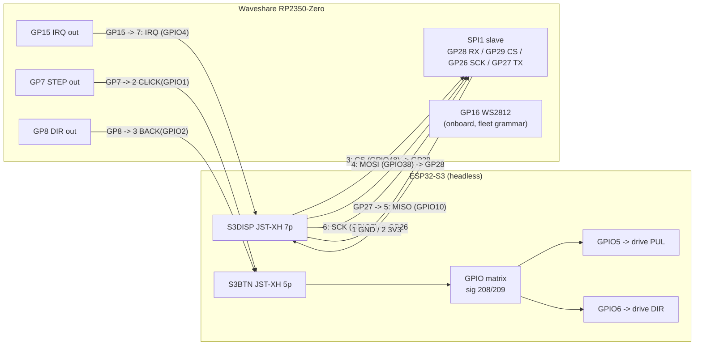

# RP2350-Zero loom -- wiring reference (sd-dxy)

The Zero DROPS STRAIGHT IN between the two parallel JSTs, stepstick-style:
its width bridges S3DISP and S3BTN, so every connection is connector pin to
the RP pad that physically meets it -- no jumpers. The RP2350's SPI mux is
fixed (pin mod 4: RX, CSn, SCK, TX), so the ROLES are chosen to be legal at
those pads, and the S3's GPIO matrix remaps its side to match (the matrix
routes FSPI anywhere; ~40 MHz ceiling, we run 8). The old silk names (SCK/
DC/CS) described a display that was never fitted -- trust the role column,
not the silk. RP pins match `src/rp2350_motion/main.cpp` exactly.

## S3DISP -- JST-XH 7p (power + SPI link)

| pin | silk | S3 GPIO | RP pad it meets | role on the wire |
|----:|------|--------:|-----------------|------------------|
| 1 | GND | - | **GND** | common ground -- connect FIRST, remove LAST |
| 2 | 3V3 | - | **3V3** | powers the Zero from the S3 (see the USB note) |
| 3 | SCK | 48 | **GP29** (SPI1 CSn) | **CS** -- S3 emits chip-select on GPIO48 |
| 4 | MOSI | 38 | **GP28** (SPI1 RX) | MOSI, S3 -> RP (segments, ops) |
| 5 | RST | 10 | **GP27** (SPI1 TX) | MISO, RP -> S3 (status/runway) |
| 6 | DC | 7 | **GP26** (SPI1 SCK) | **SCK** -- S3 emits clock on GPIO7 |
| 7 | CS | 4 | **GP15** (plain GPIO) | **IRQ**, RP -> S3, active HIGH (feed me) |

S3-side master pinout that follows (for the driver, not yet written):
**SCK = GPIO7, CS = GPIO48, MOSI = GPIO38, MISO = GPIO10, IRQ in = GPIO4.**

## S3BTN -- JST-XH 5p (pulse return)

| pin | S3 net | S3 GPIO | wire to RP2350-Zero | role |
|----:|--------|--------:|---------------------|------|
| 1 | GND | - | **GND** | second ground return for the pulse pair |
| 2 | CLICK | 1 | **GP7** | STEP, RP -> S3 -> matrix -> drive PUL (GPIO5) |
| 3 | BACK | 2 | **GP8** | DIR, RP -> S3 -> matrix -> drive DIR (GPIO6) |
| 4 | TOGGLE | 3 | *(spare)* | unused, leave free |
| 5 | NC | - | - | - |

## The picture

## Bench notes

- **Ground first.** Both connectors carry a GND; land them before any signal
  and lift them last (transport.md, physical-layer footguns: joined signal
  pins with no shared return push the return current through the data lines).
- **USB + S3 power at the same time:** the Zero's own LDO regulates USB 5 V
  onto the same 3V3 rail that pin 2 feeds. Back-feeding an LDO output at the
  same voltage is usually tolerated, but when you plug USB in to drop a UF2,
  prefer the S3 (or at least the 3V3 wire) unpowered. Your rail, your call.
- **First light:** the Zero's pixel runs the boot **rainbow until the S3's
  first SPI word arrives**. A rainbow that never ends means the SPI wiring
  (or the S3-side master, which is still unwritten) is not talking. STEP/DIR
  reaching the drive pins needs `-DMOTION_PASSTHROUGH_BENCH` on the S3 build
  (see `MotionPassthrough.cpp`).
- **Signals are 3V3 on both ends**, no shifting anywhere. IRQ idles LOW.
- Protocol truth: [`include/comms/MotionLinkProtocol.h`](../include/comms/MotionLinkProtocol.h)
  (one header, both ends -- T20). Rulings and next steps: dev board `sd-dxy`.
