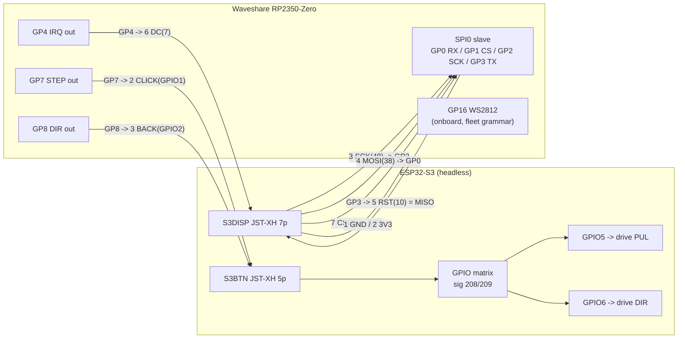

# RP2350-Zero loom -- wiring reference (sd-dxy)

Bench reference for soldering the Waveshare RP2350-Zero motion coprocessor
onto the S3's two unpopulated JSTs. The RP2350 pin choices are the Zero's
**canonical SPI0 pinset** (GP0-GP3) plus plain GPIO, and they match the
constants in [`src/rp2350_motion/main.cpp`](../src/rp2350_motion/main.cpp)
exactly -- solder to this table and the firmware needs no edits.

## S3DISP -- JST-XH 7p (power + SPI link)

| pin | S3 net | S3 GPIO | wire to RP2350-Zero | role |
|----:|--------|--------:|---------------------|------|
| 1 | GND | - | **GND** | common ground -- connect FIRST, remove LAST |
| 2 | 3V3 | - | **3V3** | powers the Zero from the S3 (see the USB note) |
| 3 | SCK | 48 | **GP2** (SPI0 SCK) | SPI clock, S3 master |
| 4 | MOSI | 38 | **GP0** (SPI0 RX) | S3 -> RP data (segments, ops) |
| 5 | RST | 10 | **GP3** (SPI0 TX) | RP -> S3 data (status/runway) = S3's MISO |
| 6 | DC | 7 | **GP4** | IRQ, RP -> S3, active HIGH ("feed me" under 4 ms runway) |
| 7 | CS | 4 | **GP1** (SPI0 CSn) | chip select, S3 master |

## S3BTN -- JST-XH 5p (pulse return)

| pin | S3 net | S3 GPIO | wire to RP2350-Zero | role |
|----:|--------|--------:|---------------------|------|
| 1 | GND | - | **GND** | second ground return for the pulse pair |
| 2 | CLICK | 1 | **GP7** | STEP, RP -> S3 -> matrix -> drive PUL (GPIO5) |
| 3 | BACK | 2 | **GP8** | DIR, RP -> S3 -> matrix -> drive DIR (GPIO6) |
| 4 | TOGGLE | 3 | *(spare)* | unused, leave free |
| 5 | NC | - | - | - |

## The picture

## Bench notes

- **Ground first.** Both connectors carry a GND; land them before any signal
  and lift them last (transport.md, physical-layer footguns: joined signal
  pins with no shared return push the return current through the data lines).
- **USB + S3 power at the same time:** the Zero's own LDO regulates USB 5 V
  onto the same 3V3 rail that pin 2 feeds. Back-feeding an LDO output at the
  same voltage is usually tolerated, but when you plug USB in to drop a UF2,
  prefer the S3 (or at least the 3V3 wire) unpowered. Your rail, your call.
- **First light:** the Zero's pixel runs the boot **rainbow until the S3's
  first SPI word arrives**. A rainbow that never ends means the SPI wiring
  (or the S3-side master, which is still unwritten) is not talking. STEP/DIR
  reaching the drive pins needs `-DMOTION_PASSTHROUGH_BENCH` on the S3 build
  (see `MotionPassthrough.cpp`).
- **Signals are 3V3 on both ends**, no shifting anywhere. IRQ idles LOW.
- Protocol truth: [`include/comms/MotionLinkProtocol.h`](../include/comms/MotionLinkProtocol.h)
  (one header, both ends -- T20). Rulings and next steps: dev board `sd-dxy`.
