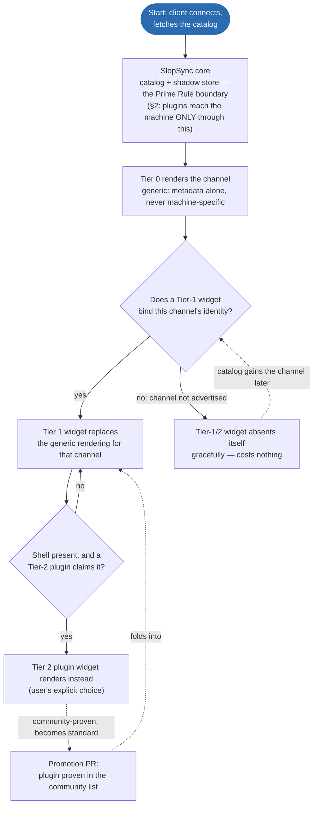
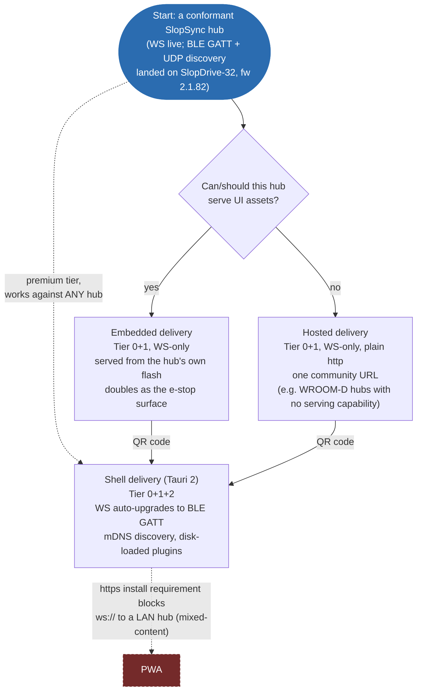

# SlopDeck — the gold-standard SlopSync client & widget system

Status: DESIGN (operator-ratified direction, 2026-07-27; §8 delivery ruling
landed same day). This is the home ([CANON C-1](../canon/CANON.md)) for
the client/widget architecture. Wire truth stays in the SlopSync repo
(sibling checkout, pinned by `slopsync.pin`); SlopDeck is everything above
the wire.

## 1. What SlopDeck is

The first-party SlopSync client — a Tauri 2 application whose UI core doubles
as a community framework — plus the widget/plugin system that lets the
experience be upgraded per-capability without ever bloating the standard.

Goals, in priority order:
1. **Compatible with every SlopSync hub** — any conformant hub gets a
   complete, correct, safe UI with zero SlopDeck knowledge of the machine.
2. **Gold-standard full experience** for capabilities that have earned it
   (SlopMotion planning, fray-d's Advanced pattern generator, the SlopDrive
   telemetry set).
3. **User-controlled customization** — widget upgrades are visible, optional,
   swappable, and user-installable.
4. **The standard grows by proof** — community widgets earn promotion the way
   protocol changes earn RFC numbers.

## 2. The Prime Rule (operator ruling, 2026-07-27)

> **Plugins add features through SlopSync, not around it. If a plugin needs
> something that isn't part of SlopSync, that thing gets implemented — in the
> protocol or the firmware — at that point.**

Consequences, all deliberate:
- The plugin API surface IS the SlopSync model: the catalog, the shadow store
  (reported state in, intents out, pending → echo-confirmed lifecycle), the
  event stream, and roles. No socket access, no side channels, no HTTP
  backdoors.
- Ground-truth doctrine ([DOCTRINE.md](../canon/DOCTRINE.md) §3) holds
  structurally: a plugin cannot
  lie about machine state because it never owns state — it renders the shadow
  store and submits intents like everyone else.
- A plugin hitting a protocol gap is the discovery mechanism for the next
  RFC — the client-side twin of the spec-gap ritual.

## 3. The three tiers

**Tier 0 — generic catalog renderer (the floor).** Renders ANY advertised
channel from catalog metadata alone: layout fields → readouts, schema keys →
typed setting cards, options → selects, `option_access` → role gating, safety
exemptions honored. Never removed, never machine-specific. This tier is the
conformance claim "works with every hub" and is the client-side floor of
the SlopSync repo's RENDERING.md derivation chain (catalog entry →
category → rank → archetype → widget pattern → region → page).

**Tier 1 — standard widgets (the earned set).** Rich widgets that BIND TO
REGISTERED CHANNEL IDENTITIES, not machines — registry numbers are
ecosystem-wide and never renumbered, so binding on channel id is
machine-agnostic by construction. A Tier-1 widget MUST absent itself
gracefully when its channel isn't advertised (the catalog is the negotiation;
absence costs nothing). The standard grows widgets, never requirements.

Founding set (operator-ratified 2026-07-27):
| Widget | Binds to |
|---|---|
| Motion hero + telemetry chart | motion STATE channel |
| Safety bar + anomaly log | safety STATE, motion-anomaly EVENT |
| SlopMotion tuning + plan strip | plan-strip, slopmotion-diag, tuning intents |
| fray-d Advanced generator panel | pattern/ap_* intent family + preset store |

*(Channel ids intentionally omitted from this table — see [CHANNEL-MAP.md](../slopsync/CHANNEL-MAP.md)
for the current numbers; a Tier-1 binding is to a channel's registered
IDENTITY, which survives renumbering, not to a number restated here.)*

**Tier 2 — plugins (user-installed upgrades).** Same widget interface as
Tier 1, loaded dynamically by the Tauri shell. Distribution: a community
plugin list (submission model, like the protocol's PRs-welcomed posture).
Promotion pipeline: plugin → community-proven → PR into the Tier-1 set with
its channel bindings — the RFC ethos applied to UI.

Reading the diagram: the two decision diamonds are re-evaluated per
channel, not once per session — a page with ten advertised channels walks
this flow ten times, independently, every catalog refresh. The dashed
edges are the two loops that close the system: a plugin earning its way
into the standard (bottom), and a channel that was absent showing up in a
later firmware and being picked up automatically (left).

## 4. The widget contract

A widget declares:
- `binds`: registered channel id(s) (and/or intent families) it upgrades;
- `renders`: the slot it fills (dashboard card, hero, strip, pane) — the same
  regions SlopSync's RENDERING.md §9 defines for the generic
  renderer, so a Tier-1 widget composes into the page tree Tier 0 already
  builds instead of fighting it;
- what it receives: a scoped view of the shadow store for its channels + the
  catalog entries it bound;
- what it may do: submit intents (queued through the core's pending→echo
  lifecycle), subscribe to events, persist per-widget user settings.

Trust model: plugins run as trusted code (community-review culture), but the
API is deliberately narrow enough — store-scoped, no socket, no global DOM
contract — that sandboxing can be added later without breaking conformant
plugins. Anything a plugin "needs" beyond this is a Prime Rule event (§2).

**Freeze discipline:** the moment the first external plugin exists, the
widget API is frozen the way `hub.hpp` is frozen
([CANON C-6](../canon/CANON.md)): additive
evolution only, versioned, never breaking. Design it small and boring.

## 5. Compliance testing — the sim modes (replaces the old approach)

History: the sim's catalog was previously reduced/diverged from the device
specifically to exercise the UI's generic rendering. Ruling: that was the
wrong mechanism — it left the primary test surface permanently degraded and
let the committed fixture drift from reality
([`docs/canon/LEDGER.md`](../canon/LEDGER.md), 2026-07-27).

The replacement — **catalog profiles as a sim flag**:
- `--profile device` (DEFAULT): full device fidelity — the complete
  SlopDrive-32 catalog incl. plan-strip (0x1110), power (0x1010),
  slopmotion-diag (0x1111), motion-anomaly (0x4100), and `raw_10um`. What
  SlopDeck develops against; what the committed fixture is captured from.
- `--profile alien`: a deliberately weird conformant hub — unknown vendor
  channels, odd units, sparse metadata, missing niceties, hostile-but-legal
  catalog shapes. Tier 0 proves genericity here; Tier 1 proves graceful
  absence here.
- `--profile minimal`: the smallest conformant catalog (roughly today's
  reduced sim) — the "any hub at all" floor.

Test mapping: fixture + Tier-1 tests ↔ `device`; genericity/compliance tests
↔ `alien` + `minimal`. **LANDED (2026-07-28 overnight):** this was milestone
1 of the sequencing below (§7) — all three profiles exist, the fixture is
re-captured at full device fidelity, and the sim's prior `[FAIL]`s are
fixed. See [`docs/canon/LEDGER.md`](../canon/LEDGER.md), "Sim fidelity
(SlopDeck milestone 1)."

**Known gap (unfixed):** 19 device-catalog entries — machine-modes,
SlopMotion tuning + `sm-set`, fray-d Advanced pattern + its six modifiers,
the preset roster/store/cmd trio, machine-admin — advertise in the `device`
profile with full fidelity but have no live STATE publish or INTENT
handling in the sim yet; their writes NACK `UNKNOWN_CHANNEL`. This blocks
building/testing the SlopMotion-tuning and fray-d-Advanced Tier-1 widgets
(§3) against the sim until closed.

> DEMO-CANDIDATE: `sim/slopsim --profile minimal` next to `--profile
> device`, same client, to show the "any hub at all" floor and the full
> reference machine side by side — the portability claim made concrete.

## 6. Architecture notes

- The existing Svelte 5 client (post catalog-driven rebuild) is the seed: its
  `core/slopsync/` + `model/` layers become the framework's kernel (the
  shadow store IS the plugin API's data plane), and the existing widgets
  become the Tier-1 exemplars during interface extraction.
- Tauri 2 shell owns: plugin discovery/loading, the community plugin list,
  updates, multi-hub connections (mDNS `_slopsync._tcp` + manual), and
  whatever the embedded-UI ruling (§8) leaves to it.
- The UI kernel stays publishable as the community "webui framework" project
  regardless of §8's outcome.

## 7. Sequencing

1. **Sim fidelity** — `--profile device` at full catalog; re-capture the
   fixture (respelled labels ride along); `alien`/`minimal` profiles;
   un-FATAL `slopsync-sim.mjs` against `device`.
   **LANDED 2026-07-28** — see §5 above and
   [`docs/canon/LEDGER.md`](../canon/LEDGER.md).
2. **Widget interface extraction** — formalize the contract from the four
   founding widgets; Tier 0/1 split becomes explicit in the codebase.
   **Still open** as of 2026-07-28.
3. **Tauri 2 shell** — wrap the client, plugin loader, first Tier-2 plugin
   (dogfood: something small, e.g. a session-stats card). **Still open.**
4. **API freeze + docs** — widget contract documented, versioned, frozen;
   community plugin list opened. **Still open.**
5. Embedded-UI ruling (§8) executed wherever it lands. **§8 is RULED**
   (see above); the SlopDrive-32 embedded delivery already exists — see
   [webui-architecture.md](../webui-architecture.md). Hosted/Shell builds
   of the same kernel are still open.

## 8. RULED (operator, 2026-07-27) — delivery vehicles

**Serving a UI is a hub capability, never a requirement**
(SlopSync RFC-043). One
Svelte client kernel, three delivery vehicles, tiers orthogonal to delivery:

- **Embedded (hubs with the capability):** a thin client exposing ALL
  controls at Tier 0+1 — the machine-served page, zero-install from any
  browser on the LAN, doubles as the emergency surface (tokenless e-stop is
  role-exempt by design). SlopDrive-32 (S3, 16 MB) ships this.
- **Hosted (the universal path):** a canonical community-hosted instance of
  the same client, served over **plain http** (deliberate — see landmine
  below), for hubs that cannot or should not serve assets. The ESP32
  WROOM-D / OSSM-reference-PCB hub is the motivating first-class target:
  limited, mediocre, fully legitimate — "just because you don't have the
  capability to host HTTP doesn't mean you should suffer."
- **Shell (Tauri 2, the premium tier):** same bundle in a native frame,
  buying back what browsers confiscate: mDNS discovery (`_slopsync._tcp` —
  no web page can ever do this), no mixed-content wall, Tier 2 plugin
  loading from disk, and non-WS transports (SlopSync over BLE GATT /
  serial — SlopSync RFC-043's hub-side twin).

  **Truth check (2026-07-28): the firmware half of this landed.**
  SlopSync-over-BLE-GATT (the hub-side `ITransport`) plus UDP discovery
  shipped and are live on fw 2.1.82 — see
  [`docs/canon/LEDGER.md`](../canon/LEDGER.md), Phase E + the DEPLOY +
  LIVE-VERIFY session. What's still open is purely client-side: the Shell
  is what SPEAKS BLE GATT from the client end (browsers can't, portably),
  and that client work has not started. "Not load-bearing for the core
  promise" still holds — WS-only clients keep working against this same
  hub unchanged.

**Recorded landmine — PWA is NOT a delivery vehicle.** PWAs require https to
install, and an https origin cannot open `ws://` to a LAN hub
(mixed-content). Until/unless hubs speak wss (TLS on ESP32 = cert pain,
explicitly not planned), the browser story is the plain-http hosted page and
the embedded page — both of which work everywhere, including iOS Safari.
Nobody promises a PWA. If browsers eventually strangle plain-http pages, the
Shell is the pre-built exit.

Reading the diagram: the dashed edge into Shell says it is reachable
independent of the embedded/hosted decision — any hub, WS or BLE, can be
opened directly from the Shell without going through a web page first. The
dashed edge into PWA is the recorded dead end: not a delivery path, a
landmine to not step on.

**The delivery accord (operator-blessed, 2026-07-27):** one Svelte kernel,
shipped two ways. The SlopDeck app (Tauri; Android APK + desktop installers —
Play Store bans adult apps, distribution is direct) is the canonical,
feature-complete client: BLE+WS auto-upgrade, mDNS discovery, Tier 2 plugins,
mobile-first per the audience map (mainstream = mobile app; power users =
desktop + MFP; Intiface/VR = desktop streamer + mobile/hardware remote; OSSM
hardware owners = the underutilized-hardware audience SlopSync exists to
serve). The embedded/hosted page is the same bundle built WS-only at Tier
0+1 — served from capable hubs' flash and from one community URL; it is the
zero-install onramp, guest/iOS surface, and emergency stop. The faces
cross-promote (page → QR → app). Divergence between targets is build
configuration, never code. The bar: discovery just works, the mobile app
just works — and if an iOS store listing ever becomes possible, it just
works too (the Tauri iOS target stays buildable; no promises on Apple).

**Transport doctrine (same ruling):** SlopSync is the only protocol that
matters and is transport-agnostic (SlopSync SPEC.md §13);
every hub SHOULD expose both WS and BLE GATT on ESP32-class hardware. The
legacy OSSM BLE masquerade is EOL — SlopSync-over-BLE replaces it, and
SlopDeck's Shell is what speaks it client-side (browsers can't, portably).
See [`docs/canon/DOCTRINE.md`](../canon/DOCTRINE.md) §9 (transport
doctrine) + SlopSync RFC-043.

## 9. Framework ruling — Svelte 5, with one piece of insurance

Svelte 5 is confirmed as the kernel framework (operator + agent concurrence,
2026-07-27). Rationale: the framework compiles away — smallest runtime of the
mainstream options, which the flash-budgeted embedded build hard-requires;
fine-grained rune reactivity fits high-rate telemetry (25–60 Hz updates
without VDOM diffing); the existing catalog-driven client is already Svelte 5
and proven. React fails the embedded budget and the update model; Solid would
be a lateral move not worth a rewrite; Lit/web-components would tax Tier-1
widget DX.

**The insurance (binding on the Tier-2 API):** plugins are NOT Svelte
components. The plugin ABI is framework-neutral — a plugin exports
`mount(slotEl, api)` / `unmount()` and ships self-contained; the kernel
treats it as a black box in its slot. This is what makes the C-6-style API
freeze survivable: SlopDeck can upgrade Svelte majors without breaking one
plugin, and plugin authors can use any framework or none. Svelte's internals
never become public API.

> DEMO-CANDIDATE: a minimal vanilla-JS plugin (`mount`/`unmount`, no
> framework at all) rendering one live-updating card, to prove the ABI
> insurance concretely — no Svelte required to build a Tier-2 widget.
