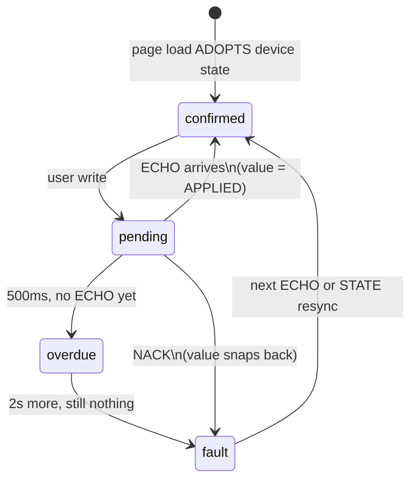

# The WebUI, rebuilt: a catalog-driven client

**Status:** rebuilt 2026-07-27 on `feat/cpp20-slopsync`. Replaces the hand-wired
page recorded in [`docs/http-plane-retirement.md`](http-plane-retirement.md) §7,
answering the refactor call in
[`docs/REFACTOR-ROADMAP.md`](REFACTOR-ROADMAP.md) §5.
**Restore point:** tag `webui-prerefactor` (commit `e77bd1f`) is the last
hand-wired bundle that shipped and worked. `git checkout webui-prerefactor -- webui/`
brings it back whole. Client/widget architecture beyond this device:
[`docs/slopdeck/DESIGN.md`](slopdeck/DESIGN.md).

---

## 1. What was actually wrong

M5c moved every control onto SlopSync and the page still felt the same, because
what shipped was **wiring, not architecture**: `cmd.js` held a `switch` mapping
each legacy op to one intent. Every control was still hand-written, still bound
to one machine.

The diagnosis is a single fact. Twenty annotated, persisted, live-tunable
SlopMotion settings shipped on the wire — and **the page showed nothing**,
because nothing in the page was built from the catalog. The device was already
emitting a richer settings surface than any client rendered.

A census of the old page found the rest of the damage: transport mode doubly
dead (unrouted op *and* a 410'd endpoint), the entire servo Configure pane
write-dead, "Save All Settings" toasting failure on every press and returning
before reconciling anything, pattern START toasting a false rejection while
actually starting, `/api/clients` and `/api/gen` 404s the UI still called, and
the user/input limit sliders never routed at all.

None of those are fixed individually here. They are gone because **a control
that does not exist in the catalog is never drawn**.

## 2. The shape

```
src/core/slopsync/     the protocol client — UNCHANGED, and allowed to know wire numbers
  session, catalog, cbor, frames, credentials, identity, sha256

src/model/             pure transform + reactive spine (mine to reason about)
  settings.js          catalog  ->  tabs -> cards -> fields, widget already chosen
  roles.js             registry role vocabulary + the hero CLAIM mechanism
  machine.svelte.js    one session, projected into Svelte state
  shadow.svelte.js     the Ground Truth Doctrine, implemented once
  format.js            presentation driven by catalog units/steps

src/ui/                rendering — knows no machine
  Field.svelte         renders ONE field, whatever it is
  heroes.js            role -> bespoke widget registry
  hero/                RailWidget, PatternWidget, LimitsWidget
  LinkBar, SafetyBar, SlopSyncPane, LogPane, PairingPane
```

The rule at the `src/model/` boundary: **a role is portable, a channel id is
not.** `window.min` is registry vocabulary and means the same thing on every
conforming hub forever; `0x1000` means something only here. Binding to the first
is why our nice widgets work on someone else's machine; binding to the second is
the disease this refactor removes. The normative rule this client implements —
category → rank → archetype → widget pattern → region — is
[RENDERING.md](slopsync/RENDERING.md); `roles.js` and `heroes.js` are this
client's read of that derivation chain.

## 3. Ground truth, mechanically

`shadow.svelte.js` is the only place a write may be in flight and the only thing
that decides what a control displays while it is.



While pending the control shows the **requested** value, because a slider that
springs back under a thumb is unusable — but it is styled unconfirmed the whole
time. The instant the ECHO lands the control shows the **applied** value, so a
clamp from 950 to 800 visibly changes the number in front of the operator. That
snap is the feature: it is the machine correcting the client in public.

On NACK or timeout the request is **discarded** and the control returns to
reported truth. A value the machine refused is never kept.

Two rate policies fall out of the catalog rather than out of taste:
- **read**: subscribe at `min(channel max, 30 Hz)` — the rate we can paint.
  Asking 333 Hz to render 60 wastes the machine's airtime and gets us shed first.
- **write**: each INTENT channel gets a coalescing queue clocked at *its own*
  advertised rate. Dragging a slider at 60 Hz into a 5 Hz channel would earn
  RATE_LIMITED NACKs and make every control look broken.

Coalescing is also a correctness fix, not just a throughput one: sending window
min and max as two intents lets the hub clamp against a bound the operator is
mid-drag on. One intent carrying both is atomic from the machine's side.

## 4. The claims, and how to fail them

A standard you cannot fail is a mood. Both of these run in CI and `npm run build`
gates on them — a device-knowledge leak **fails the firmware build**.

| # | Claim | How it is checked |
|---|---|---|
| 1 | Zero device knowledge above `core/slopsync/` | `npm run check:generic` — scans for channel-id literals and for wire field names *harvested live from the firmware catalog header*, so it guards new fields automatically. Comments are exempt (the files that explain the rule necessarily name it). |
| 2 | Renders a machine it has never met | `npm run check:model` builds a page from a fixture catalog with ids we never allocated, a device-defined category, and a `str16` setting. **25/25.** Also runnable against `sim/slopsim`, which is now a genuinely different machine. |
| 3 | A new firmware settings channel needs no client change | Demonstrated as a before/after — see §6. |
| 4 | Ground truth everywhere | §3; visually verified in-browser via `test/browser-check.mjs`. |
| 5 | Degrades honestly | No fallback control path exists: HTTP is read-only, so a page with no hub link says so instead of pretending. |
| 6 | Unknown things render generically, never crash | Covered in `check:model`: unknown packed type → fallback widget, unlabeled device category → generated label, unknown role → carried not rejected. |
| 7 | Accessible + responsive | Pinch-zoom re-enabled (the old page blocked it), 44px targets, real ARIA, `prefers-reduced-motion` honored, 360px floor asserted by the browser check. |
| 8 | One bundle, device and Tauri | The only delta is host selection + `setHttpGet`, both isolated in `src/main.js`. |

## 4a. The visual identity, and why it is not new

The palette, type ramp and accent semantics are ported from `webui-prerefactor`
rather than redesigned. Operator ruling: *"the rail and hero numbers are pretty
much off limits, I put days into those and they make sense to a chimpanzee and
look amazing... the identity is pretty much locked."* Top and bottom bars were
explicitly opened up for improvement; everything else keeps its character.

The one thing worth stating in full, because it is load-bearing:

- **`--reality` (blue) = measured truth.** Live motion, confirmed values,
  active controls.
- **`--intent` (purple) = commanded, not yet confirmed.**
- **`--warn` / `--bad` are SAFETY colors and are never themed**, so hazard
  styling and e-stop read identically in all nine themes.

That vocabulary already existed in the rail — the commanded marker is drawn in
intent-purple — so the shadow lifecycle now speaks it too: **pending is
intent-purple, overdue escalates to warn-amber, fault is bad-red, and the
confirm flash is reality-blue.** An unconfirmed slider and an unconfirmed rail
marker are now saying the same thing in the same color, which is what the
first draft (amber-for-everything) got wrong.

Themes are pure browser preference (`model/theme.js`, localStorage, nine
palettes plus a custom pair). Nothing there is ever sent to the machine, so the
ground-truth doctrine does not apply to it.

`--radius` is 2px. The square-cornered instrument look is intentional.

## 4b. The dashboard

Operator request: arrange the page like a Home Assistant dashboard — drag,
resize, persist. Built on one rule that makes it safe across machines:

**The saved layout is a map keyed by a STABLE STRING ID, never an array.**
Item ids are `hero:rail`, `group:2:Stroke window`, and so on. An id in storage
that the connected machine does not have is ignored; an item the machine has
that storage does not know about takes a default and appends. So pointing the
same browser at a different machine cannot scramble a saved arrangement, and a
firmware update that adds a settings card cannot either.

> DEMO-CANDIDATE: rearrange the dashboard, reload against a firmware build
> with one extra settings channel, then reload against the ORIGINAL
> machine again — the saved layout surviving the round trip is the point,
> and it is a 30-second demo of a rule that is hard to appreciate as
> prose.

Two details that are correctness, not polish: the drag handle is an explicit
grab target rather than the whole card (the cards are full of sliders, and a
draggable card body would eat every control inside it), and `touch-action:
none` is set only on handles — putting it on the body would kill page scrolling
on a phone.

## 5. What the protocol gained

All additive; no released number reused; frozen artifacts untouched.

- **`action.*` roles** ([RFC-019](slopsync/RFC-QUEUE.md) open convention, no registry change) on the home,
  admin and safety op fields — so action buttons are *discoverable* instead of
  hardcoded. `move` was deliberately **not** tagged: its fields are values, not
  verbs, and tagging them would make a generic client draw a button where a
  slider belongs.
- **`pattern.*` roles** (6 new registry entries, codegen rerun) so the generator
  card renders on any machine with a built-in pattern engine — not just ours.
- **`telemetry.uptime`** finally applied; it was registered and unused.

Catalog cost: 15,817 → **16,073 B** of 24,576 B scratch. **8,503 B headroom.**

## 6. The sharpest test, demonstrated

Claim #3 is the one M5c failed. It is now demonstrated rather than asserted,
because the device was still running the *old* firmware when the model was first
pointed at it:

```
BEFORE (catalog 15,915 B — no role annotations)
  actions : none — this machine exposes no discoverable verbs
  pattern : DECLINED — required roles absent on this machine
```

The client is not changed between these two runs. Only the firmware's catalog
annotations are. Evidence in `webui/test/evidence/`.

> DEMO-CANDIDATE: point the same running client at `sim/slopsim --profile
> alien` and `--profile device` back to back — a machine with unknown
> vendor channels and odd units rendering correctly, live, next to the
> real one, is claim #2 (`npm run check:model`) made visible instead of
> "25/25" in a table.

## 6a. TWO PROTOCOL GAPS THE REBUILD EXPOSED — read this first

**Truth check (2026-07-28): both gaps below are landed on the registry/catalog
side.** [RFC-032](slopsync/RFC-QUEUE.md) shipped the same day this section was
written: `position` on `0x3100 move` now carries role `command.position`,
`tgt_10um` on `0x1100 motion` carries `telemetry.target` — see
[WEBUI-HANDOFF-RFC-BATCH.md](slopsync/WEBUI-HANDOFF-RFC-BATCH.md) item 2. Per
this doc's own §3/§5 model, the client needed no code change (`model/
settings.js` already indexes non-action roles into `byRole`). **Not confirmed:**
`LEDGER.md` has no record of the tap-to-move end-to-end live check the handoff
doc calls for (tap → INTENT → ECHO → carriage moves → `telemetry.target`
follows) — treat as landed-but-unverified-live, not as an open protocol gap.
Original diagnosis kept below for the reasoning; both were found because a
component *refused to fabricate data*, which is exactly what should happen.

**1. No generic client can command a manual move.**
`0x3100 move` exists and works, but its `position` field carries no role. The
`action.*` convention deliberately marks VERBS, and position is a value — so
tagging it `action.move` would make a generic client draw a button where a
slider belongs (the roles agent was right to decline). The consequence is that
the rail's tap-to-move tape is **disabled on every machine**, including ours,
and the widget says so in plain text instead of hardcoding `0x3100`.

*Fix:* register a value-role for a commanded absolute target — e.g.
`command.position` — and tag that field. `model/settings.js` already indexes
non-action schema roles (added tonight) so `byRole` will surface it the moment
the firmware ships it.

**2. There is no `telemetry.target`, so "commanded" and "lag" are gone.**
The device publishes `tgt_10um` next to `pos_10um` on the motion channel, but
only position and velocity have registered roles. The hero numerals therefore
ship **actual** and **speed** only. Deriving a commanded position from the
window bounds would have been the exact optimistic-UI lie the doctrine forbids,
so the rail port dropped both numerals rather than invent them.

*Fix:* register `telemetry.target` and tag that field. Lag is then just
actual − commanded and both numerals come back for every client, not just ours.

Neither gap is a regression in behavior — the old page could only do these
things because it hardcoded this device. Making them portable is the work.

## 7. Known gaps and honest limits

- **`/uitoken` grants `control`, never `configure`.** So the hosted UI cannot
  approve pairings, and `PairingPane` says exactly that rather than showing an
  empty list that would read as "nobody is knocking".
  **Truth check (2026-07-28): partially closed since this was written.**
  [RFC-027](slopsync/RFC-QUEUE.md)(c)'s push-to-pair mode landed with no UI
  at all — three quick power-cycles calls `Hub::openPresenceWindow()` from
  the firmware's own boot-gesture detector, granting `configure` to the
  first knock if the trust ledger is factory-fresh. See
  [http-plane-retirement.md](http-plane-retirement.md) §7,
  "Push-to-pair IS reachable now." **Still the real gap:** the
  knock-and-approve ceremony (`Hub::openPairing()`) still has no caller in
  firmware, so a machine that already has a configure-holder still cannot
  approve any *later* client from this UI — that part is machine-side,
  not UI-side, and is what `PairingPane`'s honest-limits message is about.
- **`shadow.svelte.js` is not unit-tested in node** — `$state` needs the Svelte
  compiler, so its logic is only exercised in-browser. Putting the pure lifecycle
  in a plain `.js` with a thin reactive wrapper would fix this and is the right
  next refactor.
- **Motor telemetry cannot be validated right now.** With the motor unplugged the
  sensors report *plausible but wrong* values — not noise, not garbage. So no
  client-side inference of hardware health exists anywhere in this UI, and none
  should be added: asserting a condition the machine never reported is the
  ground-truth defect in its flattering direction. The power card shows what
  `0x1010` says, labeled as a sensor reading.
- A categorized **EVENT** channel contributes no settings fields, so the live
  model check reports `motion-anomaly carries a category but produced no fields`.
  Benign — its events surface in the Log pane — but the warning is accurate and
  the model could surface EVENT schemas as log documentation.
